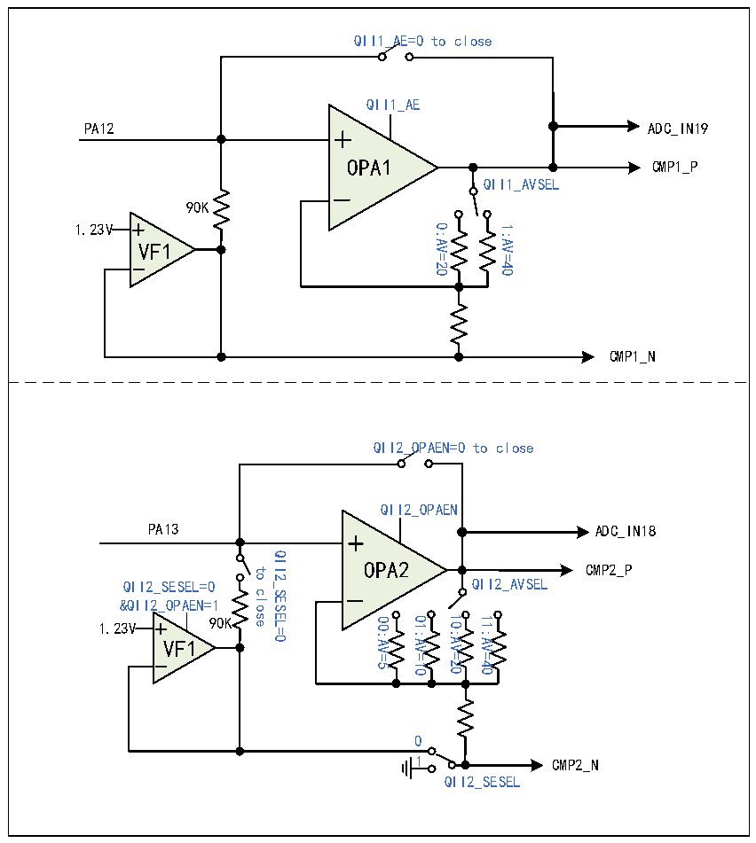

<!-- source-page: 215 -->

[← p.214](0214.md) · [index](../README.md) · [PDF p.215](https://ch32-riscv-ug.github.io/CH32M030/datasheet_zh/CH32M030RM.PDF#page=215) · [p.216 →](0216.md)

<!-- header: CH32M030应用手册 https://wch.cn -->

图17-1 OPA1和OPA2的结构图  
 <!-- rendered from the PDF; verify at https://ch32-riscv-ug.github.io/CH32M030/datasheet_zh/CH32M030RM.PDF#page=215 -->

🖼 Text parsed from the figure above

QII1_AE=0 to close  
QII1_AE  
PA12 ADC_IN19  
OPA1 CMP1_P  
OPA1  
QII1_AVSEL  
90K  
1.23V  
0:AV=20 1:AV=40  
VF1  
VF1  
CMP1_N  
QII2_OPAEN=0 to close  
QII2_OPAEN  
PA13  
ADC_IN18  
QII2_SESEL=0  
OPA2 CMP2_P  
OPA2  
to  
QII2_SESEL=0 QII2_AVSEL  
close  
&amp;QII2_OPAEN=1  
00:AV=5 01:AV=10 10:AV=20 11:AV=40  
1.23V 90K  
VF1  
VF1  
0  
1 CMP2_N  
QII2_SESEL  

### 17.2.2 运算放大器 3/4（OPA3/OPA4）

OPA3、OPA4支持单端及差分输入，可通过更改配置进行PGA放大倍数选择，还提供内部自偏置电  
压。其中，OPA3的输出结果在芯片内部连接至电压比较器CMP2或CMP3，以及ADC通道IN9；OPA4的  
输出结果在芯片内部连接至电压比较器CMP3，以及ADC通道IN10。  
在ISP_CTLR寄存器中：配置ISPx_EN位，可使能OPA模块；配置ISPx_GAIN[1:0]位，可使能运  
放增益的大小；配置 ISPx_VFBIAS 位，选择模块参考电压；配置 ISPx_NSEL 位，配置模块负端输入；  
配置ISPx_SEL_IO位，使能模块输出至ADC；配置QDETx_EN位，使能Q值检测；配置DETx_PD30K位，  
使能Q值检测30K电阻；配置QDETx_VBSEL位，使能Q值检测参考电压。  
<!-- image: p215-draw-image-00001 bbox=[507.84, 786.48, 527.52, 797.04] -->
<!-- footer: V1.2 214 -->
