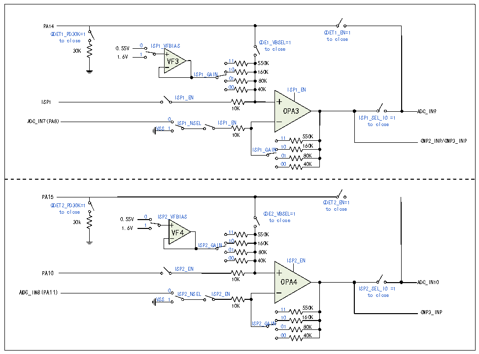

<!-- source-page: 216 -->

[← p.215](0215.md) · [index](../README.md) · [PDF p.216](https://ch32-riscv-ug.github.io/CH32M030/datasheet_zh/CH32M030RM.PDF#page=216) · [p.217 →](0217.md)

<!-- header: CH32M030应用手册 https://wch.cn -->

图17-2 OPA3和OPA4的结构图  
 <!-- rendered from the PDF; verify at https://ch32-riscv-ug.github.io/CH32M030/datasheet_zh/CH32M030RM.PDF#page=216 -->

🖼 Text parsed from the figure above

PA14 QDET1_PD30K=1 QDET1_EN=1 to close QDE1_VBSEL=1 to close 30K 0.55V 0 ISP1_VFBIAS to close 1.6V 1 VF3 11 550K ISP1_GAIN 10 160K 01 80K 00 40K ISP1_ENISP1_ENISP1 10K OPA3 ADC_IN9 ADC_IN7(PA8) 0 ISP1_NSEL ISP1_EN ISP 1 t _ o S E c L l _ o I s O e =1 VSS 1 10K 11 550K CMP2_INP/CMP3_INP ISP1_GAIN 10 160K 01 80K 00 40K  PA15 QDET2_PD30K=1 QDET2_EN=1 to close QDE2_VBSEL=1 to close 30k 0.55V 0 ISP2_VFBIAS to close 1.6V 1 VF4 11 550K ISP2_GAIN 10 160K 01 80K 00 40K ISP2_ENISP2_ENPA10 10K OPA4 ADC_IN10 ADC_IN8(PA11) 0 ISP2_NSEL ISP2_EN ISP 2 t _ o S E c L l _ o I s O e =1 VSS 1 10K 11 550K CMP3_INP 10 160KISP2_GAIN 01 80K 00 40K  

### 17.2.3 比较器 1/2（CMP1/CMP2）

CMP1支持可选迟滞特性，支持输出端数字滤波功能，且输出滤波可选。  
CMP2支持可选迟滞特性，支持内部N端偏置可选以及输出端数字滤波功能。其P端通道可由GPIO  
输入或者在芯片内部与OPA运放连接；其N端通道可由GPIO输入或者在芯片内部与DAC输出连接。  
在QII_CFGR寄存器中：配置QII1_AE位，可使能CMP1模块；配置QII1_HYPSEL位，可选择比较  
器迟滞电压。  
在 CMP_CTLR 寄存器中：配置 CMP1_FILT_EN 位，使能 CMP1 输出数字滤波功能；配置  
CMP1_FILT_CFG[4:0]位，可选择 CMP1 输出数字采样间隔，采样间隔设置要大于噪声宽度，小于两倍  
噪声宽度；配置CMP1_TO_IO位，可使能CMP1输出至IO。  
在 CMP_STATR寄存器中：通过 CMP1_OUT/CMP1_OUT_FILT 位，可读取 CMP1 滤波功能关闭/开启的  
输出结果。  
在QII_CFGR寄存器中：配置QII2_AE位，可使能CMP2模块；配置QII2_HYPSEL位，可选择比较  
器迟滞电压。  
在 CMP_CTLR 寄存器中：配置 CMP2_FILT_EN 位，使能 CMP2 输出数字滤波功能；配置  
CMP2_FILT_CFG[4:0]位，可选择 CMP2 输出数字采样间隔，采样间隔设置要大于噪声宽度，小于两倍  
噪声宽度；配置 CMP2_TO_IO 位，可使能 CMP2 输出内部连接至 IO 功能；配置 CMP2_BK_EN 位，使能  
CMP2输出连接到定时器1刹车输入端；可配置CMP2_INT_EN位使能CMP2输出中断。  
在 CMP_STATR寄存器中：通过 CMP2_OUT/CMP2_OUT_FILT 位，可读取 CMP2 滤波功能关闭/开启的  
输出结果；通过CMP2_COMIF位，可读出CMP2输出为高电平中断标志。  
<!-- image: p216-draw-image-00001 bbox=[507.84, 786.48, 527.52, 797.04] -->
<!-- footer: V1.2 215 -->
