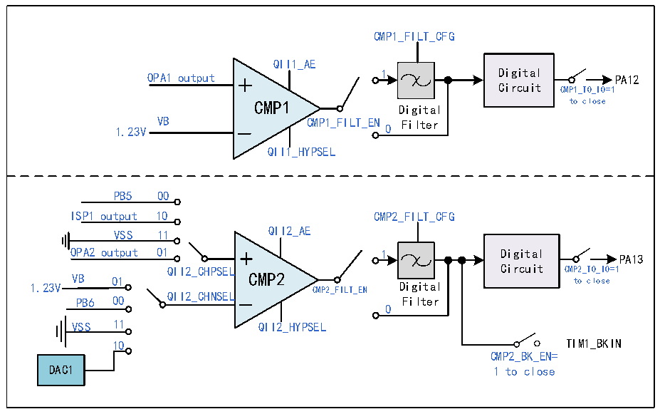

<!-- source-page: 217 -->

[← p.216](0216.md) · [index](../README.md) · [PDF p.217](https://ch32-riscv-ug.github.io/CH32M030/datasheet_zh/CH32M030RM.PDF#page=217) · [p.218 →](0218.md)

<!-- header: CH32M030应用手册 https://wch.cn -->

图17-3 CMP1和CMP2的结构图  
 <!-- rendered from the PDF; verify at https://ch32-riscv-ug.github.io/CH32M030/datasheet_zh/CH32M030RM.PDF#page=217 -->

🖼 Text parsed from the figure above

CMP1_FILT_CFG  
QII1_AE  
OPA1 output 1 Digital PA12  
Circuit CMP1_TO_IO=1  
CMP1 to close  
Digital  
1.23V VB CMP1_FILT_EN 0 Filter  
QII1_HYPSEL  
PB5 00  
ISP1 output 10 CMP2_FILT_CFG  
VSS 11 QII2_AE  
OPA2 output 01 1 Digital  
PA13  
QII2_CHPSEL Circuit CMP2_TO_IO=1  
VB 01 CMP2 to close  
1.23V Digital  
PB6 00 QII2_CHNSEL CMP2_FILT_EN Filter  
0  
VSS 11 QII2_HYPSEL  
10 TIM1_BKIN  
CMP2_BK_EN=  
DAC1 1 to close  

### 17.2.4 比较器 3（CMP3）

CMP3 支持可选迟滞特性，支持内部 N 端偏置可选，以及输出端数字滤波功能。其 P 端通道可由  
GPIO输入或者在芯片内部与 OPA运放连接；其N端通道由 GPIO输入；其电压比较结果 OUT0由 GPIO  
模拟输出，OUT1和OUT2通过GPIO口推挽输出。此外，在芯片内部，CMP3的输出通道连接到TIM2的  
四个通道，用于捕获触发，还连接到TIM1的BKIN通道，作为TIM1的刹车源。  
在CMP3_CFGR寄存器中：配置EN位，可使能CMP3模块；配置PSEL/NSEL位，可选择CMP3正/负  
端输入通道；配置HYS位，选择迟滞电压大小；配置DACDAT[3:0]位，选择CMP3模块DAC输出电压；  
配置OEN位，使能CMP3输出至IO；配置MODE_IOSEL位，可选择CMP3输出连接到IO；或配置CMP_CTLR  
寄存器的CMP3_BK_EN位，将输出连接至TIM1的刹车输入端。  
在CMP_CTLR寄存器中：配置CMP3_FILT_EN位，使能CMP3输出数字滤波功能；配置CMP3_FILT_CFG  
位，可选择CMP3输出数字采样间隔，采样间隔设置要大于噪声宽度，小于两倍噪声宽度；配置CMP3_CAP  
位，可使能CMP3比较输出内部连接到定时器2的4个通道功能；配置CMP3_TRG_SRC位，可选择CMP3  
定时器2通道切换硬件触发源，并通过设置CMP3_TRG_GATE位，开/关CMP3定时器2通道硬件触发通  
道切换；或配置CMP3_COM_MODE位，可使能CMP3连续比较模式；配置CMP3_INT_EN位，可产生CMP3  
输出中断，并可通过CMP_STATR寄存器CMP3_CHOUTx位，读取CMP3各通道进行切换的比较输出结果，  
即CMP3输出为高电平的中断标志。  
在 CMP3_SW 寄存器中：配置 CH_NUM 位，可配置定时器 2 的通道捕获的通道数量，并通过  
OUT_POL_CHx位对相应通道的输出极性进行配置。  
在 CMP_STATR寄存器中：通过 CMP3_OUT/CMP3_OUT_FILT 位，可读取 CMP3 滤波功能关闭/开启的  
输出结果，并可通过CMP3_CHOUTx位，读取CMP3各通道进行切换的比较输出结果，即CMP3输出为高  
电平的中断标志。  
<!-- image: p217-draw-image-00001 bbox=[507.84, 786.48, 527.52, 797.04] -->
<!-- footer: V1.2 216 -->
