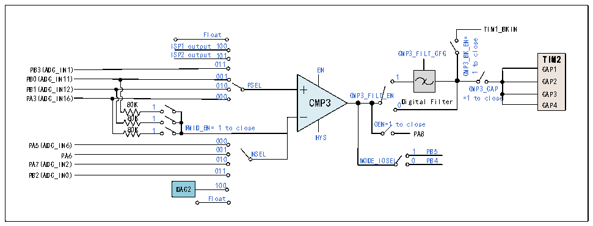
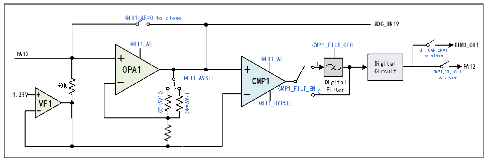

<!-- source-page: 218 -->

[← p.217](0217.md) · [index](../README.md) · [PDF p.218](https://ch32-riscv-ug.github.io/CH32M030/datasheet_zh/CH32M030RM.PDF#page=218) · [p.219 →](0219.md)

<!-- header: CH32M030应用手册 https://wch.cn -->

图17-4 CMP3结构图  
 <!-- rendered from the PDF; verify at https://ch32-riscv-ug.github.io/CH32M030/datasheet_zh/CH32M030RM.PDF#page=218 -->

🖼 Text parsed from the figure above

TIM1_BKIN  
Float  
CMP3_BK_EN= close  
ISP1 output 100  
ISP2 output 101 CMP3_FILT_CFG  
TIM2  
to  
011  
CAP1  
PB3(ADC_IN1) EN  
e  
1  
PB0(ADC_IN11) 001 PB1(ADC_IN12) 010 PSEL CMP3_CAP  
1 CAP2  
CAP3 0 CAP4  
PA3(ADC_IN16) 80K 1 000 CMP3 CMP3_FILT_EN Digital Filter =1 to close  
80K 1  
80K 1 RMID_EN= 1 to close OEN=1 to close 000 HYS  
PA8  
PA5(ADC_IN6)  
PA6 0 0 1 0 0 1 NSEL MODE_IOSEL 0 1 P P B B 4 5  
PA7(ADC_IN2)  
011  
PB2(ADC_IN0)  
DAC2 100  
Float  

### 17.2.5 交流小信号放大解码器（QII1/QII2）

交流小信号放大解码器（QII）包括1个前级的可调增益放大器OPA和1个后级的电压比较器CMP。  
输入的交流小信号通过OPA进行放大，并使用CMP整形为数字信号，经数字滤波后解码，也可以将放  
大后的信号送入ADC进行解码。  
在QII_CFGR寄存器中：配置QII1_AE位，可使能QII1模块；配置QII1_HYPSEL位，可选择QII1  
模块比较器迟滞电压；配置QII1_AVSEL位，可选择QII1模块运放增益大小。  
在 CMP_CTLR 寄存器中：配置 CMP1_FILT_EN 位，使能 CMP1 输出数字滤波功能；配置  
CMP1_FILT_CFG[4:0]位，可选择 CMP1 输出数字采样间隔，采样间隔设置要大于噪声宽度，小于两倍  
噪声宽度；配置CMP1_TO_IO位，可使能CMP1输出至IO；配置QII_CAP_EN位，可使能QII输出内部  
直接送至TIM3通道1捕获。  
在 CMP_STATR寄存器中：通过 CMP1_OUT/CMP1_OUT_FILT 位，可读取 CMP1 滤波功能关闭/开启的  
输出结果。  

图17-5 QII1结构图  
 <!-- rendered from the PDF; verify at https://ch32-riscv-ug.github.io/CH32M030/datasheet_zh/CH32M030RM.PDF#page=218 -->

🖼 Text parsed from the figure above

QII1_AE=0 to close  
ADC_IN19  
QII1_AE CMP1_FILT_CFG  
TIM3_CH1  
QII_CAP_EN=1 to close  
PA12 QII1_AE  
Digital OPA1 Circuit  
1 PA12 CMP1_TO_IO=1  
QII1_AVSEL to close Digital  
CMP1  
90K  
CMP1_FILT_EN0 Filter  
0:AV=20  
1.23V  
1:AV=40  
VF1  
QII1_HYPSEL  

在QII_CFGR寄存器中：配置QII2_AE位，可使能QII2模块；配置QII2_OPAEN位，可使能QII2  
模块内部OPA2；配置QII2_HYPSEL位，可选择QII2模块比较器迟滞电压；配置QII2_AVSEL位，可选  
择QII2模块运放增益大小；配置QII2_SESEL位，可使能QII2模块单端放大模式；配置QII2_DACEN  
位，使能QII2模块DAC功能，并通过QII2_DAC[3:0]位可选择DAC输出电压大小。  
在 CMP_CTLR 寄存器中：配置 CMP2_FILT_EN 位，使能 CMP2 输出数字滤波功能；配置  
CMP2_FILT_CFG[4:0]位，可选择 CMP2 输出数字采样间隔，采样间隔设置要大于噪声宽度，小于两倍  
噪声宽度；配置CMP2_TO_IO位，可使能CMP2输出内部连接至IO功能；配置QII_CAP_EN位，可使能  
QII 输出内部直接送至 TIM3 通道 1 捕获；配置 CMP2_BK_EN 位，使能 CMP2 输出连接到定时器 1 刹车  
<!-- image: p218-draw-image-00001 bbox=[507.84, 786.48, 527.52, 797.04] -->
<!-- footer: V1.2 217 -->
