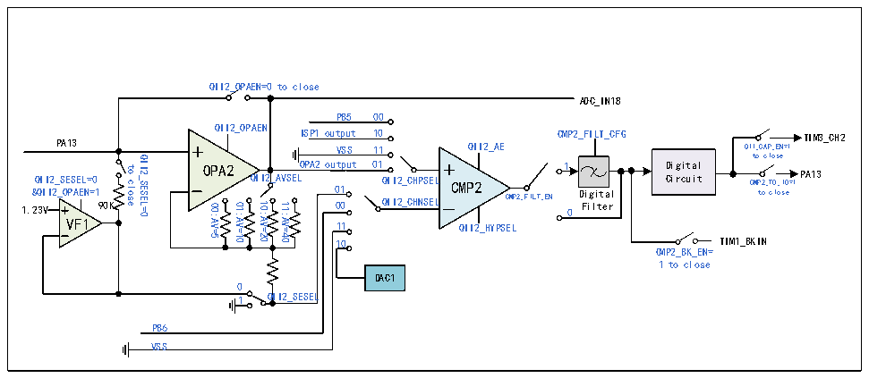
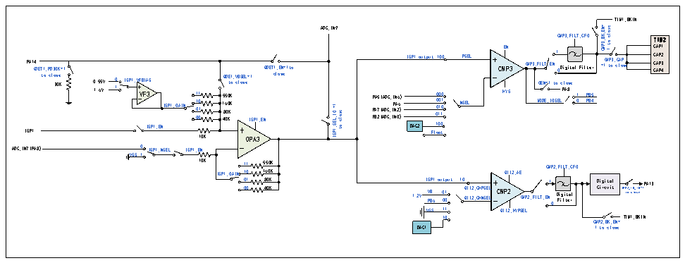

<!-- source-page: 219 -->

[← p.218](0218.md) · [index](../README.md) · [PDF p.219](https://ch32-riscv-ug.github.io/CH32M030/datasheet_zh/CH32M030RM.PDF#page=219) · [p.220 →](0220.md)

<!-- header: CH32M030应用手册 https://wch.cn -->
输入端；可配置CMP2_INT_EN位使能CMP2输出中断。  
在 CMP_STATR寄存器中：通过 CMP2_OUT/CMP2_OUT_FILT 位，可读取 CMP2 滤波功能关闭/开启的  
输出结果；通过CMP2_COMIF位，可读出CMP2输出为高电平中断标志。  

图17-6 QII2结构图  
 <!-- rendered from the PDF; verify at https://ch32-riscv-ug.github.io/CH32M030/datasheet_zh/CH32M030RM.PDF#page=219 -->

🖼 Text parsed from the figure above

QII2_OPAEN=0 to close  
ADC_IN18  
PB5 00  
QII2_OPAEN  
ISP1 output 10 VSS 11  
CMP2_FILT_CFG PA13 QII2_AE  
TIM3_CH2 QII_CAP_EN=1  
to close  
OPA2 OPA2 output 01 01 CMP2 90K  
1 Digital QII2_SESEL=0 QII2_AVSELtocloseQII2_SESEL=0 QII2_CHPSEL Circuit CMP2_TO_IO=1 PA13 1. &amp; 2 Q 3 I V I2_OPAEN=1 00 QII2_CHNSEL CMP2_FILT_EN 0 D F i i g l i t t e a r l to close  
00:AV=5 01:AV=10 10:AV=20 11:AV=40  
VF1  
11 QII2_HYPSEL  
TIM1_BKIN  
10  
CMP2_BK_EN=  
1 to close  
DAC1  
0  
1 QII2_SESEL  
PB6  
VSS  

### 17.2.6 差分输入电流采样（ISP1/ISP2）

差分输入电流采样（ISP）将外部电阻采集电流得到的弱电压信号经闭环的放大器 OPA 放大后的  
结果通过ADC通道送入ADC或比较器，ADC采样结果可用于上限比较、计算分析等。  
ISP1 和 ISP2 支持差分或单端应用。当差分应用时，ISP1 和 ISN1/PA8 引脚为一对差分输入，  
ISP2/PA10和ISN2/PA11引脚为另一对差分输入；而当单端应用时，无需负端输入ISN，此时ISN1/PA8  
和ISN2/PA11引脚可用于任何用途，例如ADC或者GPIO。  
在 ISP_CTLR 寄存器中：配置 ISPx_EN 位，可使能 ISPx 模块；配置 ISPx_GAIN[1:0]位，可使能  
ISPx模块运放增益的大小；配置ISPx_VFBIAS位，选择ISPx模块参考电压；配置ISPx_NSEL位，配  
置模块负端输入；配置ISPx_SEL_IO位，ISPx模块输出至ADC；配置QDETx_EN位，使能ISPx模块Q  
值检测；配置 DETx_PD30K 位，使能 ISPx 模块 Q 值检测 30K 电阻；配置 QDETx_VBSEL 位，使能 ISPx  
模块Q值检测参考电压。  

图17-7 ISP1结构图  
 <!-- rendered from the PDF; verify at https://ch32-riscv-ug.github.io/CH32M030/datasheet_zh/CH32M030RM.PDF#page=219 -->

🖼 Text parsed from the figure above

TIM1_BKIN  
CMP3_BK_EN= close  
ADC_IN9  
1= OI_LES_1PSI esolc ot CMP3_FILT_CFG EN QDET1_PD30K=1 ISP1 output100 CMP3 CMP3_FILT_EN Digital Filter =1 C M t P o 3 _ c C l A o P se ISP1 to clo 3 s 0 e K 1.6V 0 1 ISP1_VFBIA IS S P1_EN ISP1_GAIN 0 1 1 0 0 1 0 1 QD t E o 1_ c V l B o S s E e L= I 1 S P1_EN P P P A B A 7 2 5 ( ( ( A A A D D D C C C _ _ _ I I I P N N N A 2 0 6 6 ) ) ) DAC2 Fl 0 1 o 0 0 0 1 0 a 0 1 0 1 t 0 0 0 1 NSEL HYS OEN=1 to close  
TIM2CAP1CAP2CAP3CAP4  P  Pse  
TIM2 CAP1 PSEL 1 CAP2 CAP3 QDET c 1 l _ o E s N e =1to 0 CAP4 PA8 1 PB5 MODE_IOSEL 0 PB4  
1to  
PA14 0.55V VF3 550K 160K 80K 40K 10K OPA3  
0 ISP1_NSEL ISP1_EN  
ADC_IN7(PA8)  
VSS1  
10K 550K 160K  
11 CMP2_FILT_CFG ISP1_GAIN10 QII2_AE  
01 ISP1 output 10 1 Digital 00 PB6 0 0 1 0 Q Q I I I I 2 2 _ _ C C H H N P S S E E L L CMP2 CMP2_FILT_EN 0 D F i i g l i t t e a r l Circuit  
80K 40K  
PA13 1.2V VB CMPto2 _TcOl_oIsOe=1  
VSS 11 QII2_HYPSEL  
TIM1_BKIN CMP2_BK_EN=  
10  
DAC1  
1 to close  

<!-- image: p219-draw-image-00001 bbox=[507.84, 786.48, 527.52, 797.04] -->
<!-- footer: V1.2 218 -->
