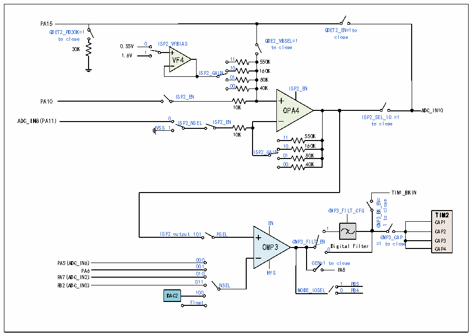

<!-- source-page: 220 -->

[← p.219](0219.md) · [index](../README.md) · [PDF p.220](https://ch32-riscv-ug.github.io/CH32M030/datasheet_zh/CH32M030RM.PDF#page=220) · [p.221 →](0221.md)

<!-- header: CH32M030应用手册 https://wch.cn -->

图17-8 ISP2结构图  
 <!-- rendered from the PDF; verify at https://ch32-riscv-ug.github.io/CH32M030/datasheet_zh/CH32M030RM.PDF#page=220 -->

🖼 Text parsed from the figure above

PA15  
QDET2_EN=1to  
QDET2_PD30K=1  
close  
to close QDE2_VBSEL=1  
30K 0.55V 0 ISP2_VFBIAS to close  
1.6V 1  
VF4 11 550K  
ISP2_GAIN 10 160K  
01 80K  
00 40K ISP2_EN  
ISP2_EN  
PA10  
10K OPA4 ADC_IN10  
ADC_IN8(PA11) 0 ISP2_NSEL ISP2_EN ISP 2 t _ o S E c L l _ o I s O e =1  
VSS 1  
10K 11 550K  
10 160K  
ISP2_GAIN  
01 80K  
00 40K  
TIM1_BKIN  
CMP3_BK_EN= close  
CMP3_FILT_CFG  
TIM2  
to  
CAP1  
EN  
e  
1  
1 CAP2  
ISP2 output 101 PSEL CMP3_CAP  
CAP3 0 CAP4  
CMP3 CMP3_FILT_EN Digital Filter =1 to close  
PA5(ADC_IN6) 000 OEN=1 to close  
001  
PA8  
PA6 010 HYS  
PA7(ADC_IN2)  
011 PB2(ADC_IN0) NSEL  
1 PB5  
MODE_IOSEL 0 PB4  
DAC2 100  
Float  

## 17.3 寄存器描述

<!-- p220-table-002 (table-17-4@1) -->
<table><caption>表17-4 OPA相关寄存器列表</caption><tr><th>名称</th><th>访问地址</th><th>描述</th><th>复位值</th></tr><tr><td>R32_QII_CFGR</td><td>0x40024800</td><td>QII配置寄存器</td><td>0x00000000</td></tr><tr><td>R32_ISP_CTLR</td><td>0x40024804</td><td>ISP控制寄存器</td><td>0x00000000</td></tr><tr><td>R32_CMP_CTLR</td><td>0x40024808</td><td>CMP控制寄存器</td><td>0x00000000</td></tr><tr><td>R32_CMP3_CFGR</td><td>0x4002480C</td><td>CMP3配置寄存器</td><td>0x0000007E</td></tr><tr><td>R32_CMP3_SW</td><td>0x40024810</td><td>CMP3切换寄存器</td><td>0x00000000</td></tr><tr><td>R32_CMP_STATR</td><td>0x40024814</td><td>CMP状态寄存器</td><td>0x000XXXXX</td></tr></table>

### 17.3.1 QII 配置寄存器（QII_CFGR）

偏移地址：0x00  

<!-- p220-table-003 (table-17-4@1) -->
<table class="bitfield"><colgroup><col style="width:6.2500%"><col style="width:6.2500%"><col style="width:6.2500%"><col style="width:6.2500%"><col style="width:6.2500%"><col style="width:6.2500%"><col style="width:6.2500%"><col style="width:6.2500%"><col style="width:6.2500%"><col style="width:6.2500%"><col style="width:6.2500%"><col style="width:6.2500%"><col style="width:6.2500%"><col style="width:6.2500%"><col style="width:6.2500%"><col style="width:6.2500%"></colgroup><tr><th>31</th><th>30</th><th>29</th><th>28</th><th>27</th><th>26</th><th>25</th><th>24</th><th>23</th><th>22</th><th>21</th><th>20</th><th>19</th><th>18</th><th>17</th><th>16</th></tr><tr><td colspan="10">Reserved</td><td colspan="2">QII2_CHPSEL[1:0]</td><td colspan="2">QII2_CHNSEL[1:0]</td><td>Reserved</td><td>QII2_DAC[3]</td></tr></table>

<!-- p220-table-004 (table-17-4@1) -->
<table class="bitfield"><colgroup><col style="width:6.2500%"><col style="width:6.2500%"><col style="width:6.2500%"><col style="width:6.2500%"><col style="width:6.2500%"><col style="width:6.2500%"><col style="width:6.2500%"><col style="width:6.2500%"><col style="width:6.2500%"><col style="width:6.2500%"><col style="width:6.2500%"><col style="width:6.2500%"><col style="width:6.2500%"><col style="width:6.2500%"><col style="width:6.2500%"><col style="width:6.2500%"></colgroup><tr><th>15</th><th>14</th><th>13</th><th>12</th><th>11</th><th>10</th><th>9</th><th>8</th><th>7</th><th>6</th><th>5</th><th>4</th><th>3</th><th>2</th><th>1</th><th>0</th></tr><tr><td colspan="3">QII2_DAC[2:0]</td><td>QII2_DACEN</td><td>Reserved</td><td colspan="3">QII2_HYPSEL[2:0]</td><td colspan="2">QII2_AVSEL[1:0]</td><td>QII2_SESEL</td><td>QII2_OPAEN</td><td>QII2_AE</td><td>QII1_AVSEL</td><td>QII1_HYPSEL</td><td>QII1_AE</td></tr></table>

<!-- image: p220-draw-image-00001 bbox=[507.84, 786.48, 527.52, 797.04] -->
<!-- footer: V1.2 219 -->
