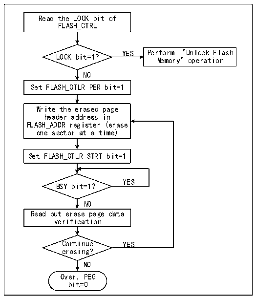

<!-- source-page: 238 -->

[← p.237](0237.md) · [index](../README.md) · [PDF p.238](https://ch32-riscv-ug.github.io/CH32M030/datasheet_zh/CH32M030RM.PDF#page=238) · [p.239 →](0239.md)

<!-- header: CH32M030应用手册 https://wch.cn -->
2）向FLASH_KEYR寄存器写入KEY2 = 0xCDEF89AB（第2步必须是KEY2）。  
上述操作必须按序并连续执行，否则属于错误操作，会锁死FPEC模块和FLASH_CTLR寄存器并产  
生总线错误，直到下次系统复位。  
闪存控制器（FPEC）和FLASH_CTLR寄存器可以通过将FLASH_CTLR寄存器的“LOCK”位，置1来  
再次锁定。  

### 19.4.3 主存储器标准擦除

闪存可以按标准页（1K字节）擦除，也可以整片擦除。  

图19-1 FLASH页擦除  
 <!-- rendered from the PDF; verify at https://ch32-riscv-ug.github.io/CH32M030/datasheet_zh/CH32M030RM.PDF#page=238 -->

🖼 Text parsed from the figure above

Read the LOCK bit of  
FLASH_CTRL  
YES Perform &quot;Unlock Flash  
LOCK bit=1?  
Memory&quot; operation  
NO  
Set FLASH_CTLR PER bit=1  
Write the erased page  
header address in  
FLASH_ADDR register (erase  
one sector at a time)  
Set FLASH_CTLR STRT bit=1  
YES  
BSY bit=1？  
NO  
Read out erase page data  
verification  
Continue YES  
erasing?  
NO  
Over，PEG  
bit=0  

1）检查FLASH_CTLR寄存器LOCK位，如果为1，需要执行“解除闪存锁”操作。  
2）设置FLASH_CTLR寄存器的PEG位为‘1’，开启标准页擦除模式。  
3）向FLASH_ADDR寄存器写入选择擦除的页首地址。  
4）设置FLASH_CTLR寄存器的STAT位为‘1’，启动一次擦除动作。  
5）等待BYS位变为‘0’或FLASH_STATR寄存器的EOP位为‘1’表示擦除结束，将EOP位清0。  
6）读擦除页的数据进行校验。  
7）继续标准页擦除可以重复3-5步骤，结束擦除将PEG位清0。  
<!-- image: p238-draw-image-00001 bbox=[507.84, 786.48, 527.52, 797.04] -->
<!-- footer: V1.2 237 -->
