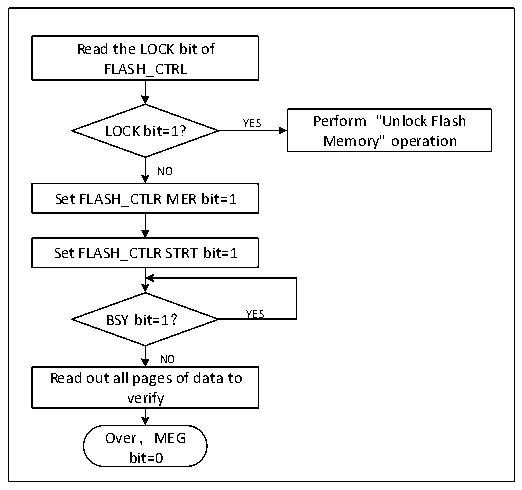

<!-- source-page: 239 -->

[← p.238](0238.md) · [index](../README.md) · [PDF p.239](https://ch32-riscv-ug.github.io/CH32M030/datasheet_zh/CH32M030RM.PDF#page=239) · [p.240 →](0240.md)

<!-- header: CH32M030应用手册 https://wch.cn -->

图19-2 FLASH整片擦除  
 <!-- rendered from the PDF; verify at https://ch32-riscv-ug.github.io/CH32M030/datasheet_zh/CH32M030RM.PDF#page=239 -->

🖼 Text parsed from the figure above

Read the LOCK bit of  
FLASH_CTRL  
YES Perform &quot;Unlock Flash  
LOCK bit=1?  
Memory&quot; operation  
NO  
Set FLASH_CTLR MER bit=1  
Set FLASH_CTLR STRT bit=1  
BSY bit=1？ YES  
NO  
Read out all pages of data to  
verify  
Over，MEG  
bit=0  

1）检查FLASH_CTLR寄存器LOCK位，如果为1，需要执行“解除闪存锁”操作。  
2）设置FLASH_CTLR寄存器的MEG位为‘1’，开启整片擦除模式。  
3）设置FLASH_CTLR寄存器的STAT位为‘1’，启动擦除动作。  
4）等待BYS位变为‘0’或FLASH_STATR寄存器的EOP位为‘1’表示擦除结束，将EOP位清0。  
5）读擦除页的数据进行校验。  
6）将MEG位清0。  

### 19.4.4 快速编程模式解锁

通过写入序列到FLASH_MODEKEYR寄存器可解锁快速编程模式操作。解锁后，FLASH_CTLR寄存器  
的FLOCK位将清0，表示可以进行快速擦除和编程操作。通过将FLASH_CTLR寄存器的“FLOCK”位软  
件置1来再次锁定。  
解锁序列：  
1）向FLASH_MODEKEYR寄存器写入KEY1 = 0x45670123；  
2）向FLASH_MODEKEYR寄存器写入KEY2 = 0xCDEF89AB。  
上述操作必须按序并连续执行，否则属于错误操作会锁定，直到下次系统复位才能重新解锁。  
注：快速编程操作需要解除“LOCK”和“FLOCK”两层锁定。  

### 19.4.5 主存储器快速编程

快速编程按页（128字节）进行编程。系统内置了128字节缓存区，将要待编程的数据线保存到  
缓存区后执行一次编程操作，效率更高。  
1）检查FLASH_CTLR寄存器LOCK位，如果为1，需要执行“解除闪存锁”操作。  
2）检查FLASH_STATR寄存器的BSY位，以确认没有其他正在进行的编程操作。  
3）检查FLASH_CTLR寄存器FLOCK位，如果为1，需要执行“快速编程模式解锁”操作。  
4）设置FLASH_CTLR寄存器的FTPG位，开启快速编程模式功能。  
5）设置FLASH_CTLR寄存器的BUFRST位，执行清除内部128字节缓存区操作。  
6）等待BYS位变为‘0’或FLASH_STATR寄存器的EOP位为‘1’表示清除结束，将EOP位清0。  
7）向指定地址开始连续写入 8 字节数据（4 字节/次操作，写的地址每次偏移量为 4），然后设置  
FLASH_CTLR寄存器的BUFLOAD位，执行加载到缓存区。  
8）等待BYS位变为‘0’或FLASH_STATR寄存器的EOP位为‘1’表示加载结束，将EOP位清0。  
9）重复步骤7-8共16次，将128字节数据都加载到缓存区（16轮操作地址要连续）。  
<!-- image: p239-draw-image-00001 bbox=[507.84, 786.48, 527.52, 797.04] -->
<!-- footer: V1.2 238 -->
