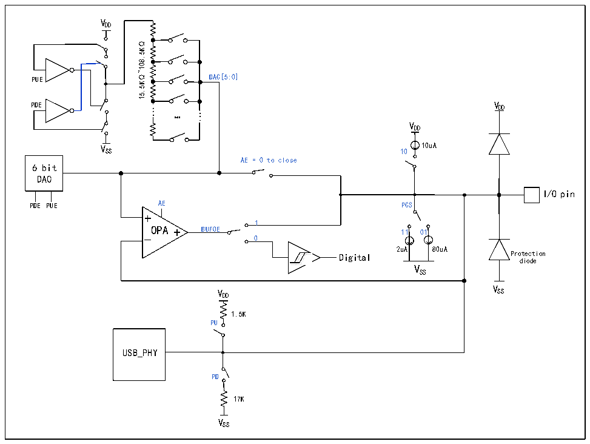

<!-- source-page: 243 -->

[← p.242](0242.md) · [index](../README.md) · [PDF p.243](https://ch32-riscv-ug.github.io/CH32M030/datasheet_zh/CH32M030RM.PDF#page=243) · [p.244 →](0244.md)

<!-- header: CH32M030应用手册 https://wch.cn -->

# 第 20 章 扩展配置（EXTEN）

## 20.1 扩展配置

系统提供了3个EXTEN扩展配置单元（EXTEN_CTLR0寄存器、EXTEN_CTLR1寄存器、EXTEN_CTLR2  
寄存器），该单元使用HB时钟，只在系统复位执行复位动作。  
EXTEN_CTLR0 寄存器包括 2 个源电流控制位，2 个 USBPD 及 CC 引脚的辅助控制位，LOCKUP 功能  
监测功能；其中源电流模块可用于外接低成本的NTC感温电阻等，通过ADC计算温度；LOCKUP功能监  
测功能：LKUPEN字段启用，将打开系统的Lock-up情况监控，一旦发生Lock-up情况，系统将进行软  
件复位，并将LKUPRST字段置1，读取后可以写1清除此标志。  
EXTEN_CTLR1寄存器包括BC接口 UDM/UDP引脚的控制位、DAC和 DAC_BUF输出缓冲器/比较器及  
端口上拉/下拉电流的控制位；BC接口的每个引脚均包含1个6位的DAC、一个输出缓冲器DAC_BUF。  
其中，DAC 不但可以输出可编程电压，还可以实现可编程的上拉电阻或下拉电阻；DAC_BUF 不但可以  
将DAC电压进行缓冲后输出到引脚，还可以作为模拟电压比较器将引脚电压与DAC电压进行比较。BC  
接口结构如图20-1所示。  
EXTEN_CTLR2 寄存器包括 2 个 10 位可编程灌电流的电流选择位。该可编程灌电流模块 ISINK 支  
持10位电流精度，可用于以20mV为步距对外部DC-DC进行高精度电压调节，实现PPS协议。  

图20-1 BC接口结构图  
 <!-- rendered from the PDF; verify at https://ch32-riscv-ug.github.io/CH32M030/datasheet_zh/CH32M030RM.PDF#page=243 -->

🖼 Text parsed from the figure above

VDD  
15.5K Ω~108.5K Ω  
PUE DAC[5:0]  
PDE V DD  
...  
...  
…  
VDD  
V SS 10 10uA  
AE = 0 to close  
6 bit  
DAC  
I/O pin  
PDE PUE AE PCS  
1  
OPA BUFOE 11 01  
0  
2uA 80uA  
Digital Protection  
<!-- image: p243-draw-image-00002 inside the figure -->
<!-- image: p243-draw-image-00003 inside the figure -->
diode  
VSS  
V  
V SS  
DD  
1.5K  
PU  
USB_PHY  
PD  
17K  
VSS  

## 20.2 功能描述

如图20-1所示的BC接口结构图，可通过EXTEN_CTLR1寄存器的UDM/UDP对应控制位配置以下几  
<!-- image: p243-draw-image-00001 bbox=[507.84, 786.48, 527.52, 797.04] -->
<!-- footer: V1.2 242 -->
