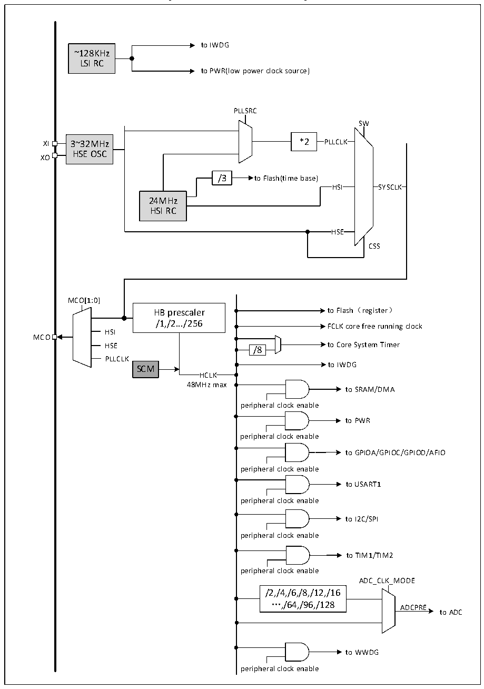

<!-- source-page: 7 -->

[← p.6](0006.md) · [index](../README.md) · [PDF p.7](https://ch32-riscv-ug.github.io/CH32V006/datasheet_en/CH32V002DS0.PDF#page=7) · [p.8 →](0008.md)

<!-- header: CH32V002 Datasheet https://wch-ic.com -->

Figure 1-3 Clock tree block diagram  
 <!-- rendered from the PDF; verify at https://ch32-riscv-ug.github.io/CH32V006/datasheet_en/CH32V002DS0.PDF#page=7 -->

🖼 Text parsed from the figure above

to IWDG  
~128KHz  
LSI RC  
to PWR(low power clock source)  
PLLSRC  
SW  
XI 3~32MHz *2 PLLCLK  
HSE OSC  
XO  
/3 to Flash(time base)  
HSI SYSCLK  
24MHz  
HSI RC  
HSE  HSE  
CSS  
MCO[1:0]  
HB prescaler to Flash（register）  
/1,/2.../256  
FCLK core free running clock  
HSI  
MCO  
HSE to Core System Timer  
/8  
PLLCLK  
to IWDG  
SCM  
HCLK  
48MHz max  
to SRAM/DMA  
peripheral clock enable  
to PWR  
peripheral clock enable  
to GPIOA/GPIOC/GPIOD/AFIO  
peripheral clock enable  
to USART1  
peripheral clock enable  
to I2C/SPI  
peripheral clock enable  
to TIM1/TIM2  
peripheral clock enable  
ADC_CLK_MODE  
/2,/4,/6,/8,/12,/16  
…,/64,/96,/128  
ADCPRE  
to ADC  
to WWDG  
peripheral clock enable  

<!-- image: p7-draw-image-00001 bbox=[514.32, 784.08, 533.76, 794.28] -->
<!-- footer: V1.7 5 -->
