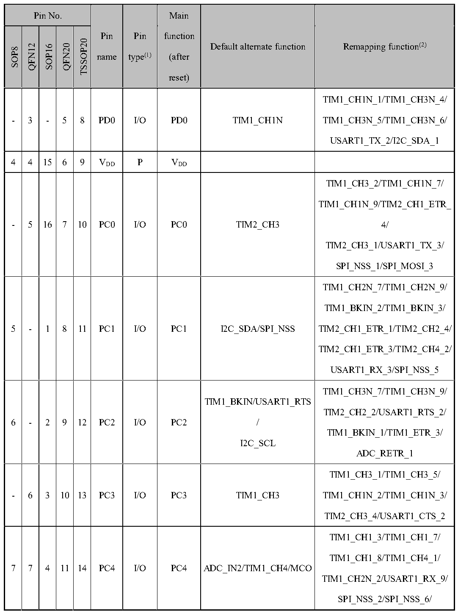

<!-- source-page: 17 -->

[← p.16](0016.md) · [index](../README.md) · [PDF p.17](https://ch32-riscv-ug.github.io/CH32V006/datasheet_en/CH32V002DS0.PDF#page=17) · [p.18 →](0018.md)

<!-- header: CH32V002 Datasheet https://wch-ic.com -->

 <!-- p17-cluster-01 uncaptioned graphics, rendered from the PDF; verify at https://ch32-riscv-ug.github.io/CH32V006/datasheet_en/CH32V002DS0.PDF#page=17 -->

🖼 Text parsed from the figure above

> ⬆ **Table continued** — rendered in full at [page 16](0016.md). <!-- p17-table-001 -->

<!-- image: p17-draw-image-00001 bbox=[518.88, 784.08, 538.32, 794.28] -->
<!-- footer: V1.7 15 -->
