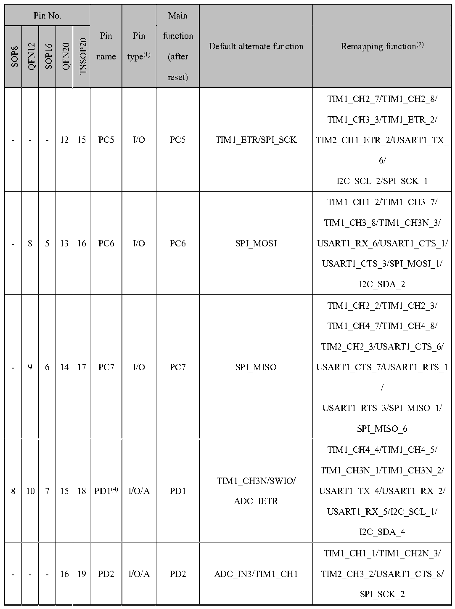

<!-- source-page: 18 -->

[← p.17](0017.md) · [index](../README.md) · [PDF p.18](https://ch32-riscv-ug.github.io/CH32V006/datasheet_en/CH32V002DS0.PDF#page=18) · [p.19 →](0019.md)

<!-- header: CH32V002 Datasheet https://wch-ic.com -->

 <!-- p18-cluster-01 uncaptioned graphics, rendered from the PDF; verify at https://ch32-riscv-ug.github.io/CH32V006/datasheet_en/CH32V002DS0.PDF#page=18 -->

🖼 Text parsed from the figure above

> ⬆ **Table continued** — rendered in full at [page 16](0016.md). <!-- p18-table-001 -->

<!-- image: p18-draw-image-00001 bbox=[518.88, 784.08, 538.32, 794.28] -->
<!-- footer: V1.7 16 -->
