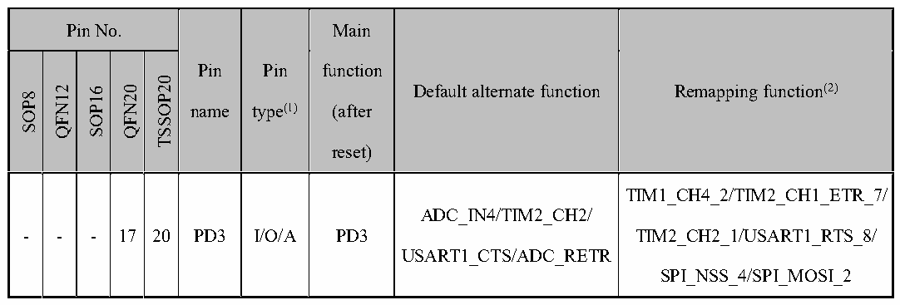

<!-- source-page: 19 -->

[← p.18](0018.md) · [index](../README.md) · [PDF p.19](https://ch32-riscv-ug.github.io/CH32V006/datasheet_en/CH32V002DS0.PDF#page=19) · [p.20 →](0020.md)

<!-- header: CH32V002 Datasheet https://wch-ic.com -->

 <!-- p19-cluster-01 uncaptioned graphics, rendered from the PDF; verify at https://ch32-riscv-ug.github.io/CH32V006/datasheet_en/CH32V002DS0.PDF#page=19 -->

🖼 Text parsed from the figure above

> ⬆ **Table continued** — rendered in full at [page 16](0016.md). <!-- p19-table-001 -->

<em>Note 1: Explanation of table abbreviations:</em>  
<em>I = TTL/CMOS level Schmitt input; O = CMOS level tri-state output.</em>  
<em>A = Analog signal input or output; P = Power supply.</em>  
<em>Note 2: The underlined value of the remapping function indicates the configuration value of the corresponding bit</em>  
<em>in the AFIO register. For example: TIM1_CH4_3 indicates that the corresponding bit configuration of the</em>  
<em>AFIO register is 011b.</em>  
<em>Note 3: For the CH32V002J4M6 chip, the PA1 and PD6 pins are short-connected and sealed inside the chip,</em>  
<em>which forbids the two I/O to be configured as the output function.</em>  
<em>Note 4: For the CH32V002J4M6 chip, the PD1, PD4 and PD5 pins are short connected and sealed inside the chip,</em>  
<em>and any two or more of the three I/O are prohibited from being configured as output functions.</em>  
<!-- image: p19-draw-image-00001 bbox=[518.88, 784.08, 538.32, 794.28] -->
<!-- footer: V1.7 17 -->
