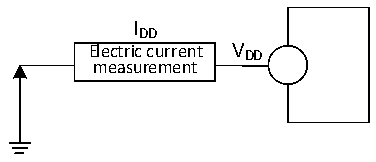

<!-- source-page: 25 -->

[← p.24](0024.md) · [index](../README.md) · [PDF p.25](https://ch32-riscv-ug.github.io/CH32V006/datasheet_en/CH32V002DS0.PDF#page=25) · [p.26 →](0026.md)

<!-- header: CH32V002 Datasheet https://wch-ic.com -->

> ⬆ **Table continued** — rendered in full at [page 24](0024.md). <!-- p25-table-001 -->

<em>Note: 1. Normal temperature test value.</em>  

### 3.3.3 Embedded Reference Voltage

<!-- p25-table-002 (table-3-5@1) -->
<table><caption>Table 3-5 Embedded reference voltage</caption><tr><th>Symbol</th><th>Parameter</th><th>Condition</th><th>Min.</th><th>Typ.</th><th>Max.</th><th>Unit</th></tr><tr><td style="text-align:left">VREFINT</td><td>Internal reference voltage</td><td style="text-align:left">T = -40℃~85℃ A</td><td>1.18</td><td>1.2</td><td>1.22</td><td>V</td></tr><tr><td style="text-align:left">TS_vrefint</td><td style="text-align:left">ADC sampling time when reading the internal reference voltage</td><td style="text-align:left">Slow sampling is recommended.</td><td>3</td><td></td><td>240</td><td style="text-align:left">1/f ADC</td></tr></table>

### 3.3.4 Supply Current Characteristics

Current consumption is a comprehensive index of a variety of parameters and factors. These parameters and  
factors include operating voltage, ambient temperature, I/O pin load, the software configuration of the product, the  
operating frequency, flip rate of the I/O pin, the location of the program in memory and the executed code, etc.  
The current consumption measurement method is as follows:  

Figure 3-2 Current consumption measurement  
 <!-- rendered from the PDF; verify at https://ch32-riscv-ug.github.io/CH32V006/datasheet_en/CH32V002DS0.PDF#page=25 -->

🖼 Text parsed from the figure above

IDD  
Electric current V DD  
measurement  

<!-- image: p25-draw-image-00001 bbox=[518.88, 784.08, 538.32, 794.28] -->
<!-- footer: V1.7 23 -->
