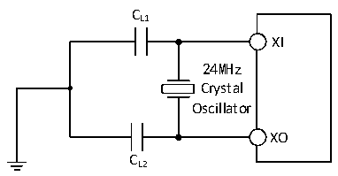

<!-- source-page: 29 -->

[← p.28](0028.md) · [index](../README.md) · [PDF p.29](https://ch32-riscv-ug.github.io/CH32V006/datasheet_en/CH32V002DS0.PDF#page=29) · [p.30 →](0030.md)

<!-- header: CH32V002 Datasheet https://wch-ic.com -->

> ⬆ **Table continued** — rendered in full at [page 28](0028.md). <!-- p29-table-001 -->

<em>Note: 1. 25M crystal ESR is recommended not more than 80Ω, less than 25m can be appropriately relaxed.</em>  
<em>2. Startup time refers to the time difference between when HSEON is turned on and when HSERDY is set.</em>  
Circuit reference design and requirements:  
The load capacitance of the crystal is subject to the recommendation of the crystal manufacturer, generally CL1=  
CL2.  

Figure 3-4 Typical circuit of external 24M crystal  
 <!-- rendered from the PDF; verify at https://ch32-riscv-ug.github.io/CH32V006/datasheet_en/CH32V002DS0.PDF#page=29 -->

🖼 Text parsed from the figure above

CL1  
XI  
24MHz  
Crystal  
Oscillator  
XO  
CL2  

### 3.3.6 Internal Clock Source Characteristics

<!-- p29-table-002 (table-3-11@1) pages 29-30 -->
<table><caption>Table 3-11 Internal high-speed (HSI) RC oscillator characteristics</caption><tr><th>Symbol</th><th>Parameter</th><th>Condition</th><th>Min.</th><th>Typ.</th><th>Max.</th><th>Unit</th></tr><tr><td rowspan="2" style="text-align:left">FHSI</td><td rowspan="2">Frequency (after calibration)</td><td>HSI_LP = 0</td><td></td><td>24</td><td></td><td>MHz</td></tr><tr><td>HSI_LP = 1</td><td>30</td><td>42</td><td>58</td><td>KHz</td></tr><tr><td style="text-align:left">DuCy HSI</td><td>Duty Cycle</td><td></td><td>45</td><td>50</td><td>55</td><td>%</td></tr><tr><td rowspan="2" style="text-align:left">ACCHSI</td><td rowspan="2" style="text-align:left">Accuracy of HSI oscillator (after calibration)</td><td style="text-align:left">HSI_LP = 0, TA = -10℃~70℃</td><td>-2.1</td><td></td><td>2.1</td><td>%</td></tr><tr><td style="text-align:left">HSI_LP = 0, TA = -40℃~85℃</td><td>-3</td><td></td><td>3</td><td>%</td></tr><tr><td style="text-align:left">t (1) SU(HSI)</td><td style="text-align:left">HSI oscillator startup stabilization time</td><td></td><td></td><td>3</td><td>8</td><td>us</td></tr><tr><td rowspan="2" style="text-align:left">IDD(HSI)</td><td rowspan="2">HSI oscillator power consumption</td><td>HSI_LP = 0</td><td></td><td>200</td><td></td><td rowspan="2">uA</td></tr><tr><td>HSI_LP = 1</td><td></td><td>8.5</td><td></td></tr></table>

<!-- image: p29-draw-image-00001 bbox=[518.88, 784.08, 538.32, 794.28] -->
<!-- footer: V1.7 27 -->
