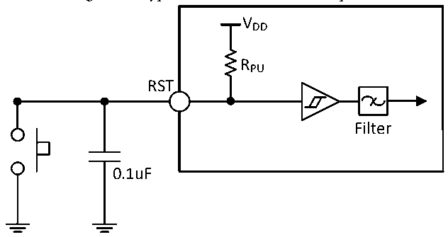
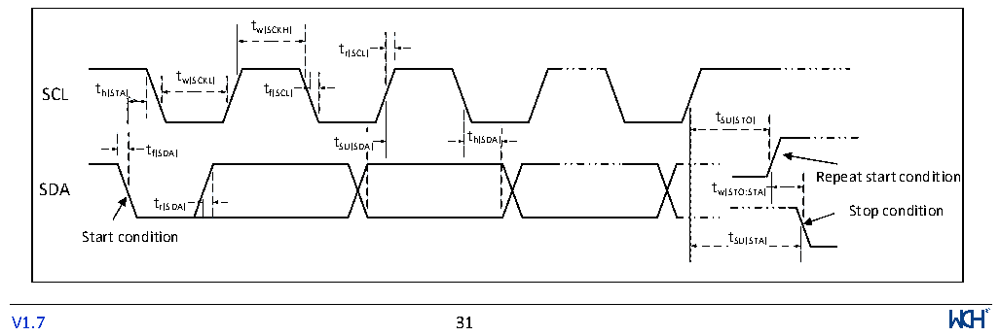

<!-- source-page: 33 -->

[← p.32](0032.md) · [index](../README.md) · [PDF p.33](https://ch32-riscv-ug.github.io/CH32V006/datasheet_en/CH32V002DS0.PDF#page=33) · [p.34 →](0034.md)

<!-- header: CH32V002 Datasheet https://wch-ic.com -->

Figure 3-5 Typical circuit of external reset pin  
 <!-- rendered from the PDF; verify at https://ch32-riscv-ug.github.io/CH32V006/datasheet_en/CH32V002DS0.PDF#page=33 -->

🖼 Text parsed from the figure above

VDD  
RPU  
RST  
Filter  
0.1uF  

<em>Note: The capacitance in the figure is optional and can be used to filter out key jitter.</em>  

### 3.3.11 TIM Timer Characteristics

<!-- p33-table-002 (table-3-20@1) -->
<table><caption>Table 3-20 TIMx characteristics</caption><tr><th>Symbol</th><th>Parameter</th><th>Condition</th><th>Min.</th><th>Max.</th><th>Unit</th></tr><tr><td rowspan="2" style="text-align:left">t res(TIM)</td><td rowspan="2">Timer reference clock</td><td></td><td>1</td><td></td><td style="text-align:left">t TIMxCLK</td></tr><tr><td style="text-align:left">f = 48MHz TIMxCLK</td><td>20.8</td><td></td><td>ns</td></tr><tr><td rowspan="2" style="text-align:left">FEXT</td><td rowspan="2" style="text-align:left">Timer external clock frequency on CH1 to CH4</td><td></td><td>0</td><td style="text-align:left">f / TIMxCLK2</td><td>MHz</td></tr><tr><td style="text-align:left">f = 48MHz TIMxCLK</td><td>0</td><td>24</td><td>MHz</td></tr><tr><td style="text-align:left">R esTIM</td><td>Timer resolution</td><td></td><td></td><td>16</td><td>bit</td></tr><tr><td rowspan="2" style="text-align:left">t COUNTER</td><td rowspan="2" style="text-align:left">16-bit counter clock cycle when the internal clock is selected</td><td></td><td>1</td><td>65536</td><td style="text-align:left">t TIMxCLK</td></tr><tr><td style="text-align:left">f = 48MHz TIMxCLK</td><td>0.0208</td><td>1363</td><td>us</td></tr><tr><td rowspan="2" style="text-align:left">t MAX_COUNT</td><td rowspan="2">Maximum possible count</td><td></td><td></td><td>65536</td><td style="text-align:left">t TIMxCLK</td></tr><tr><td style="text-align:left">f = 48MHz TIMxCLK</td><td></td><td>89.5</td><td>s</td></tr></table>

### 3.3.12 I2C Interface Characteristics

Figure 3-6 I2C bus timing diagram  
 <!-- rendered from the PDF; verify at https://ch32-riscv-ug.github.io/CH32V006/datasheet_en/CH32V002DS0.PDF#page=33 -->

🖼 Text parsed from the figure above

tw(SCKH)  
tr(SCL)  
t  
SCL t h(STA) w(SCKL) t f(SCL)  
tSU(STO)  
t t SU(SDA) t h(SDA)  
th(SDA)  
f(SDA)  
Repeat start condition  
t  
r(SDA) Stop condition  
Start condition tSU(STA)  
<!-- image: p33-draw-image-00001 inside the figure -->
<!-- footer: V1.7 31 -->

