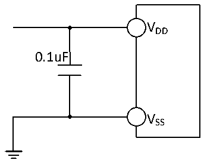

<!-- source-page: 41 -->

[← p.40](0040.md) · [index](../README.md) · [PDF p.41](https://ch32-riscv-ug.github.io/CH32V006/datasheet_en/CH32V002DS0.PDF#page=41) · [p.42 →](0042.md)

<!-- header: CH32V002 Datasheet https://wch-ic.com -->

Figure 3-11 Analog power supply and decoupling circuit reference  
 <!-- rendered from the PDF; verify at https://ch32-riscv-ug.github.io/CH32V006/datasheet_en/CH32V002DS0.PDF#page=41 -->

🖼 Text parsed from the figure above

VDD  
0.1uF  
VSS  

<!-- image: p41-draw-image-00001 bbox=[518.88, 784.08, 538.32, 794.28] -->
<!-- footer: V1.7 39 -->
