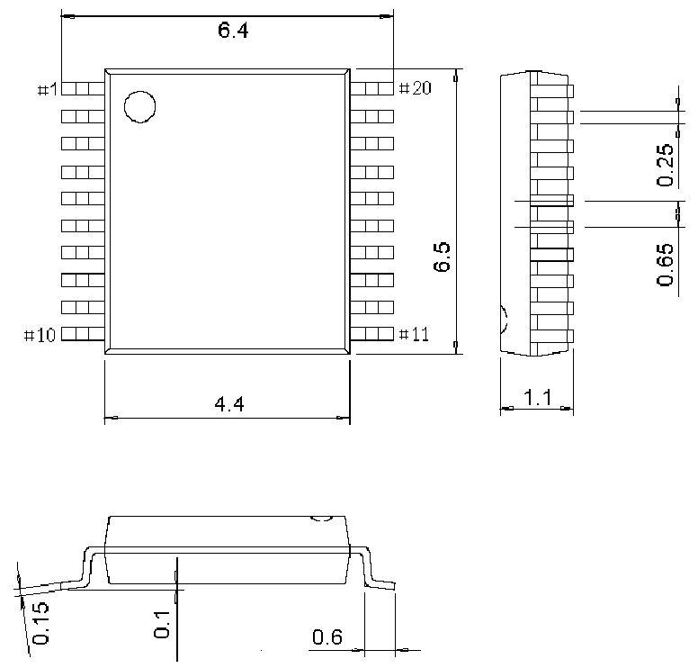

<!-- source-page: 43 -->

[← p.42](0042.md) · [index](../README.md) · [PDF p.43](https://ch32-riscv-ug.github.io/CH32V006/datasheet_en/CH32V002DS0.PDF#page=43) · [p.44 →](0044.md)

<!-- header: CH32V002 Datasheet https://wch-ic.com -->
<em>Note: All dimensions are in millimeters. The pin center spacing values are nominal values, with no error. Other</em>  
<em>than that, the dimensional error is not greater than the greater of ±0.2mm or 10%.</em>  

Figure 4-1 TSSOP20 package  
 <!-- rendered from the PDF; verify at https://ch32-riscv-ug.github.io/CH32V006/datasheet_en/CH32V002DS0.PDF#page=43 -->

🖼 Text parsed from the figure above

<!-- image: p43-draw-image-00002 inside the figure -->

<!-- image: p43-draw-image-00001 bbox=[518.88, 784.08, 538.32, 794.28] -->
<!-- footer: V1.7 41 -->
