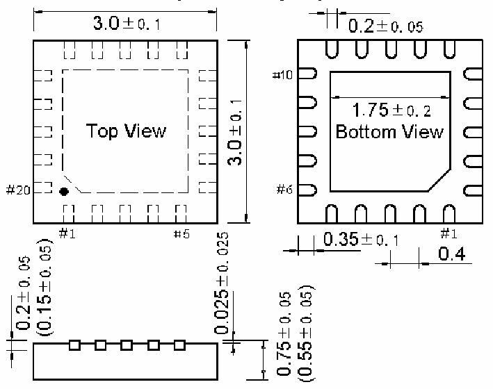
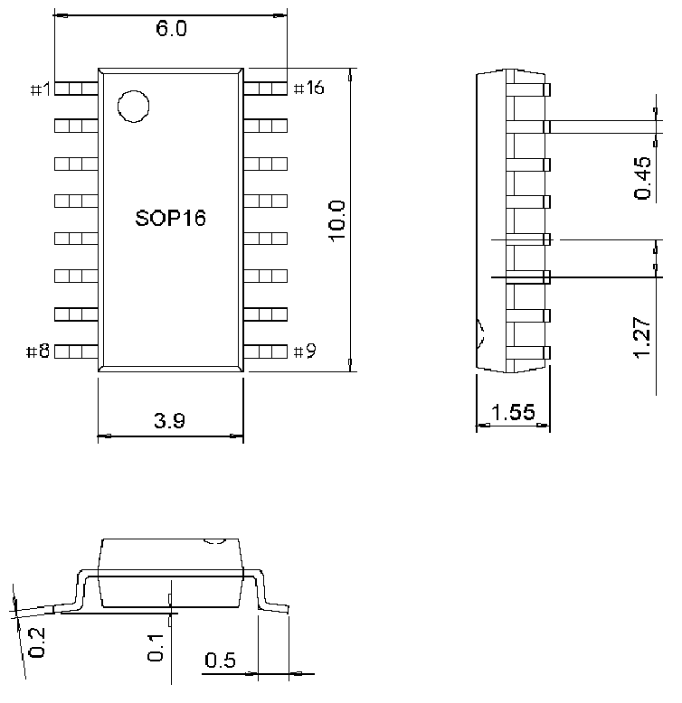

<!-- source-page: 44 -->

[← p.43](0043.md) · [index](../README.md) · [PDF p.44](https://ch32-riscv-ug.github.io/CH32V006/datasheet_en/CH32V002DS0.PDF#page=44) · [p.45 →](0045.md)

<!-- header: CH32V002 Datasheet https://wch-ic.com -->

Figure 4-2 QFN20 package  
 <!-- rendered from the PDF; verify at https://ch32-riscv-ug.github.io/CH32V006/datasheet_en/CH32V002DS0.PDF#page=44 -->

🖼 Text parsed from the figure above

<!-- image: p44-draw-image-00002 inside the figure -->

Figure 4-3 SOP16 package  
 <!-- rendered from the PDF; verify at https://ch32-riscv-ug.github.io/CH32V006/datasheet_en/CH32V002DS0.PDF#page=44 -->

🖼 Text parsed from the figure above

<!-- image: p44-draw-image-00003 inside the figure -->

<!-- image: p44-draw-image-00001 bbox=[518.88, 784.08, 538.32, 794.28] -->
<!-- footer: V1.7 42 -->
