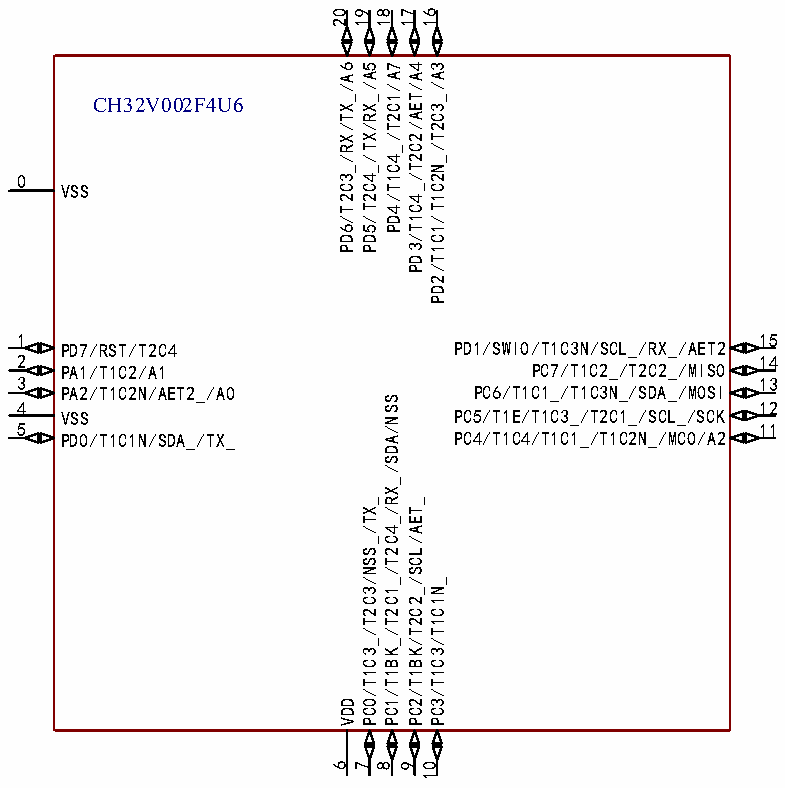

<!-- source-page: 10 -->

[← p.9](0009.md) · [index](../README.md) · [PDF p.10](https://ch32-riscv-ug.github.io/CH32V006/datasheet_zh/CH32V002DS0.PDF#page=10) · [p.11 →](0011.md)

<!-- header: CH32V002数据手册 https://wch.cn -->

# 第 2 章 引脚信息

## 2.1 引脚排列

CH32V002F4P6  
1 20  
PD4/T1C4_/T2C1/A7 PD3/T1C4_/T2C2/AET/A4  
2 19  
PD5/T2C4_/TX/RX_/A5 PD2/T1C1/T1C2N_/T2C3_/A3  
3 18  
PD6/T2C3_/RX/TX_/A6 PD1/SWIO/T1C3N/SCL_/RX_/AET2  
4 17  
PD7/RST/T2C4 PC7/T1C2_/T2C2_/MISO  
5 16  
PA1/T1C2/A1 PC6/T1C1_/T1C3N_/SDA_/MOSI  
6 15  
PA2/T1C2N/AET2_/A0 PC5/T1E/T1C3_/T2C1_/SCL_/SCK  
7 14  
VSS PC4/T1C4/T1C1_/T1C2N_/MCO/A2  
8 13  
PD0/T1C1N/SDA_/TX_ PC3/T1C3/T1C1N_  
9 12  
VDD PC2/T1BK/T2C2_/SCL/AET_  
10 11  
PC0/T1C3_/T2C3/NSS_/TX_ PC1/T1BK_/T2C1_/T2C4_/RX_/SDA/NSS  

 <!-- p10-cluster-01 uncaptioned graphics, rendered from the PDF; verify at https://ch32-riscv-ug.github.io/CH32V006/datasheet_zh/CH32V002DS0.PDF#page=10 -->

🖼 Text parsed from the figure above

20 19  
18 17 16  
PD6/T2C3_/RX/TX_/A6 PD5/T2C4_/TX/RX_/A5 PD4/T1C4_/T2C1/A7 PD3/T1C4_/T2C2/AET/A4 PD2/T1C1/T1C2N_/T2C3_/A3  
CH32V002F4U6  
0  
VSS  
1  
15  
PD1/SWIO/T1C3N/SCL_/RX_/AET2  
PD7/RST/T2C4  
2 14  
PC7/T1C2_/T2C2_/MISO  
PA1/T1C2/A1  
3 13  
PC6/T1C1_/T1C3N_/SDA_/MOSI  
PA2/T1C2N/AET2_/A0  
PC1/T1BK_/T2C1_/T2C4_/RX_/SDA/NSS  
4 12  
PC5/T1E/T1C3_/T2C1_/SCL_/SCK  
VSS  
5  
11  
PC4/T1C4/T1C1_/T1C2N_/MCO/A2  
PD0/T1C1N/SDA_/TX_  
PC0/T1C3_/T2C3/NSS_/TX_  
PC2/T1BK/T2C2_/SCL/AET_  
PC3/T1C3/T1C1N_  
VDD  
6  
7  
8  
9  
10  

<!-- image: p10-draw-image-00001 bbox=[496.32, 779.28, 515.76, 789.6] -->
<!-- footer: V1.7 8 -->
