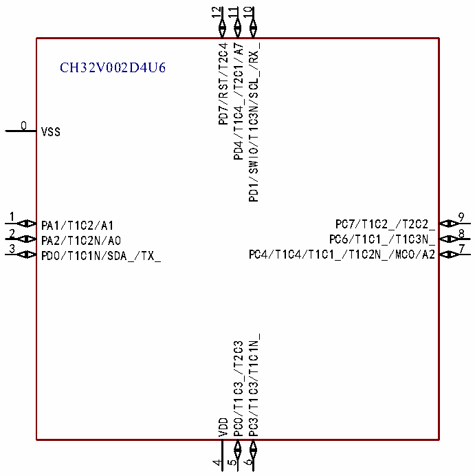

<!-- source-page: 11 -->

[← p.10](0010.md) · [index](../README.md) · [PDF p.11](https://ch32-riscv-ug.github.io/CH32V006/datasheet_zh/CH32V002DS0.PDF#page=11) · [p.12 →](0012.md)

<!-- header: CH32V002数据手册 https://wch.cn -->
CH32V002A4M6  
1 16  
PC1/T1BK_/T2C1_/T2C4_/RX_/SDA PC0/T1C3_/T2C3/TX_  
2 15  
PC2/T1BK/T2C2_/SCL/AET_ VDD  
3 14  
PC3/T1C3/T1C1N_ VSS  
4 13  
PC4/T1C4/T1C1_/T1C2N_/MCO/A2 PA2/T1C2N/AET2_/A0  
5 12  
PC6/T1C1_/T1C3N_/SDA_ PA1/T1C2/A1  
6 11  
PC7/T1C2_/T2C2_ PD7/RST/T2C4  
7 10  
PD1/SWIO/T1C3N/SCL_/RX_/AET2 PD6/T2C3_/RX/TX_/A6  
8 9  
PD4/T1C4_/T2C1/A7 PD5/T2C4_/TX/RX_/A5  

 <!-- p11-cluster-01 uncaptioned graphics, rendered from the PDF; verify at https://ch32-riscv-ug.github.io/CH32V006/datasheet_zh/CH32V002DS0.PDF#page=11 -->

🖼 Text parsed from the figure above

12  
11  
10  
PD7/RST/T2C4  
PD4/T1C4_/T2C1/A7  
PD1/SWIO/T1C3N/SCL_/RX_  
CH32V002D4U6  
0  
VSS  
1 9  
PA1/T1C2/A1 PC7/T1C2_/T2C2_  
2 8  
PA2/T1C2N/A0 PC6/T1C1_/T1C3N_  
3 7  
PD0/T1C1N/SDA_/TX_ PC4/T1C4/T1C1_/T1C2N_/MCO/A2  
PC3/T1C3/T1C1N_  
PC0/T1C3_/T2C3  
VDD  
4  
5  
6  

CH32V002J4M6  
1 8  
PA1/A1/PD6/RX/TX_/A6 PD1/SWIO/PD4/A7/PD5/TX/RX_/A5  
2 7  
VSS PC4/MCO/A2  
3 6  
PA2/A0 PC2/SCL  
4 5  
VDD PC1/SDA  
注：引脚图中复用功能均为缩写。  
示例：A:ADC_ (A1:ADC_IN1、AET:ADC_RETR、AET2:ADC_IETR)  
<!-- image: p11-draw-image-00001 bbox=[496.32, 779.28, 515.76, 789.6] -->
<!-- footer: V1.7 9 -->
