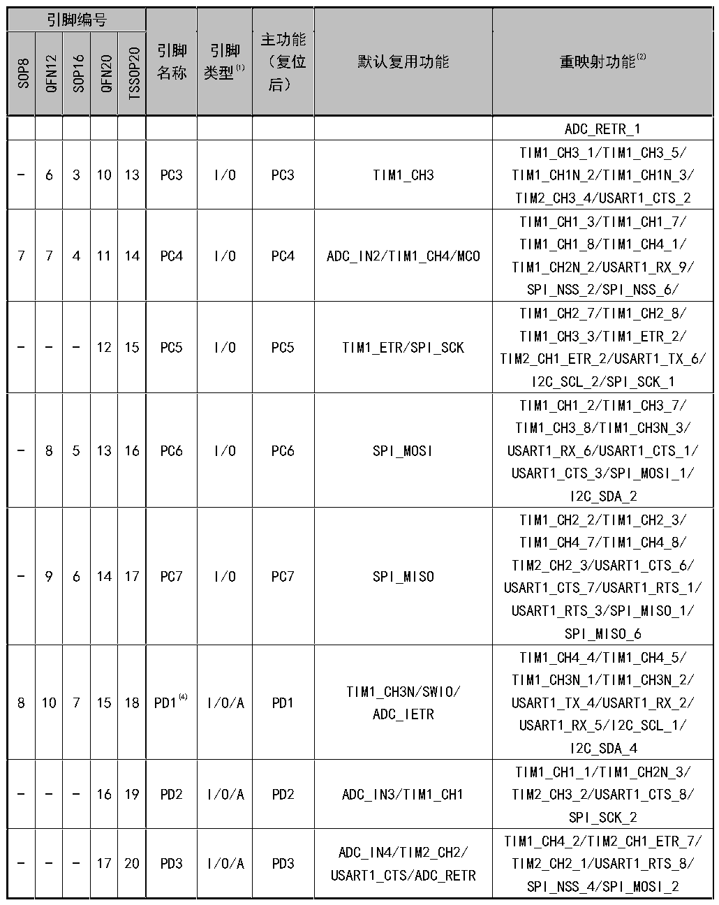

<!-- source-page: 14 -->

[← p.13](0013.md) · [index](../README.md) · [PDF p.14](https://ch32-riscv-ug.github.io/CH32V006/datasheet_zh/CH32V002DS0.PDF#page=14) · [p.15 →](0015.md)

<!-- header: CH32V002数据手册 https://wch.cn -->

 <!-- p14-cluster-01 uncaptioned graphics, rendered from the PDF; verify at https://ch32-riscv-ug.github.io/CH32V006/datasheet_zh/CH32V002DS0.PDF#page=14 -->

🖼 Text parsed from the figure above

> ⬆ **Table continued** — rendered in full at [page 13](0013.md). <!-- p14-table-001 -->

注1：表格缩写解释：  
I = TTL/CMOS电平斯密特输入；O = CMOS电平三态输出；  
A = 模拟信号输入或输出；P = 电源。  
注2：重映射功能下划线后的数值表示AFIO寄存器中相对应位的配置值。例如：TIM1_CH4_3表示AFIO寄  
存器相应位配置为011b。  
注3：对于CH32V002J4M6芯片，PA1与PD6引脚在芯片内部短接合封，禁止两个I/O均配置为输出功能。  
<!-- image: p14-draw-image-00001 bbox=[501.0, 779.28, 520.44, 789.6] -->
<!-- footer: V1.7 12 -->
