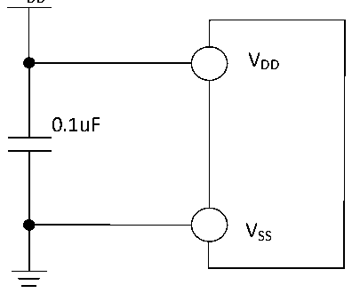

<!-- source-page: 18 -->

[← p.17](0017.md) · [index](../README.md) · [PDF p.18](https://ch32-riscv-ug.github.io/CH32V006/datasheet_zh/CH32V002DS0.PDF#page=18) · [p.19 →](0019.md)

<!-- header: CH32V002数据手册 https://wch.cn -->

# 第 3 章 电气特性

## 3.1 测试条件

除非特殊说明和标注，所有电压都以VSS 为基准。  
所有最小值和最大值将在最坏的环境温度、供电电压和时钟频率条件下得到保证。典型数值是基  
于常温25℃和VDD= 3.3V或5V的环境下用于设计指导。  
对于通过综合评估、设计模拟或工艺特性得到的数据，不会在生产线进行测试。在综合评估的基  
础上，最小和最大值是通过样本测试后统计得到。除非特殊说明为实测值，否则特性参数以综合评估  
或设计保证。  
供电方案：  

图3-1 常规供电典型电路  
 <!-- rendered from the PDF; verify at https://ch32-riscv-ug.github.io/CH32V006/datasheet_zh/CH32V002DS0.PDF#page=18 -->

VDD  

🖼 Text parsed from the figure above

VDD  
0.1uF  
VSS  

## 3.2 绝对最大值

临界或者超过绝对最大值将可能导致芯片工作不正常甚至损坏。  

<!-- p18-table-001 (table-3-1@1) -->
<table><caption>表3-1 绝对最大值参数表</caption><tr><th>符号</th><th>描述</th><th>最小值</th><th>最大值</th><th>单位</th></tr><tr><td style="text-align:left">TA</td><td>工作时的环境温度</td><td>-40</td><td>85</td><td>℃</td></tr><tr><td style="text-align:left">TS</td><td>存储时的环境温度</td><td>-40</td><td>125</td><td>℃</td></tr><tr><td style="text-align:left">V -V DD SS</td><td style="text-align:left">外部主供电引脚V 上的电压DD</td><td>-0.3</td><td>5.5</td><td>V</td></tr><tr><td style="text-align:left">VIN</td><td>I/O引脚上的电压</td><td style="text-align:left">V -0.3SS</td><td style="text-align:left">V +0.3DD</td><td>V</td></tr><tr><td style="text-align:left">|△V | DD_x</td><td style="text-align:left">主供电引脚各V 之间的电压差DD</td><td></td><td>50</td><td>mV</td></tr><tr><td style="text-align:left">|△V | SS_x</td><td style="text-align:left">公共地引脚各V 之间的电压差SS</td><td></td><td>50</td><td>mV</td></tr><tr><td style="text-align:left">VESD(HBM)</td><td>普通I/O引脚的ESD静电放电电压（HBM）</td><td colspan="2">4K</td><td>V</td></tr><tr><td style="text-align:left">IVDD</td><td style="text-align:left">所有V 主供电引脚的合计总电流DD</td><td></td><td>100</td><td>mA</td></tr><tr><td style="text-align:left">IVSS</td><td style="text-align:left">所有V 公共地引脚的合计总电流SS</td><td></td><td>200</td><td>mA</td></tr><tr><td rowspan="2" style="text-align:left">IIO</td><td>任意I/O和控制引脚上的灌电流</td><td></td><td>30</td><td rowspan="5">mA</td></tr><tr><td>任意I/O和控制引脚上的源电流</td><td></td><td>-30</td></tr><tr><td rowspan="2" style="text-align:left">IINJ(PIN)</td><td>HSE的XI引脚</td><td></td><td>+/-4</td></tr><tr><td>其他引脚的注入电流</td><td></td><td>+/-4</td></tr><tr><td style="text-align:left">∑IINJ(PIN)</td><td>所有I/O和控制引脚的总注入电流</td><td></td><td>+/-20</td></tr></table>

<!-- image: p18-draw-image-00001 bbox=[502.92, 786.36, 522.36, 796.68] -->
<!-- footer: V1.7 16 -->
