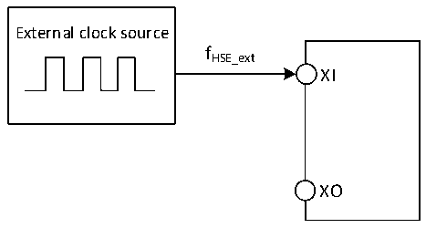

<!-- source-page: 21 -->

[← p.20](0020.md) · [index](../README.md) · [PDF p.21](https://ch32-riscv-ug.github.io/CH32V006/datasheet_zh/CH32V002DS0.PDF#page=21) · [p.22 →](0022.md)

<!-- header: CH32V002数据手册 https://wch.cn -->

> ⬆ **Table continued** — rendered in full at [page 20](0020.md). <!-- p21-table-001 -->

注：以上为实测参数。  

<!-- p21-table-002 (table-3-8@1) -->
<table><caption>表3-8 待机模式下典型的电流消耗</caption><tr><th rowspan="2">符号</th><th rowspan="2">参数</th><th colspan="3">条件</th><th rowspan="2">典型值</th><th rowspan="2">单位</th></tr><tr><td>独立看门狗</td><td>LSI</td><td style="text-align:left">VDD</td></tr><tr><td rowspan="6" style="text-align:left">IDD</td><td rowspan="6" style="text-align:left">STANDBY待机模式下的供应电流</td><td rowspan="2">开启</td><td rowspan="2">开启</td><td>3.3V</td><td>18.1</td><td rowspan="6">uA</td></tr><tr><td>5V</td><td>19.1</td></tr><tr><td rowspan="2">关闭</td><td rowspan="2">关闭</td><td>3.3V</td><td>17.5</td></tr><tr><td>5V</td><td>18.5</td></tr><tr><td rowspan="2">关闭</td><td rowspan="2">开启</td><td>3.3V</td><td>18.0</td></tr><tr><td>5V</td><td>19.0</td></tr></table>

注：以上为实测参数。  

### 3.3.5 外部时钟源特性

<!-- p21-table-003 (table-3-9@1) -->
<table><caption>表3-9 来自外部高速时钟</caption><tr><th>符号</th><th>参数</th><th>条件</th><th>最小值</th><th>典型值</th><th>最大值</th><th>单位</th></tr><tr><td style="text-align:left">FHSE_ext</td><td>外部时钟频率</td><td></td><td>3</td><td>24</td><td>32</td><td>MHz</td></tr><tr><td style="text-align:left">V (1) HSEH</td><td>XI输入引脚高电平电压</td><td></td><td style="text-align:left">0.8VDD</td><td></td><td style="text-align:left">VDD</td><td>V</td></tr><tr><td style="text-align:left">V (1) HSEL</td><td>XI输入引脚低电平电压</td><td></td><td>0</td><td></td><td style="text-align:left">0.2VDD</td><td>V</td></tr><tr><td style="text-align:left">C in(HSE)</td><td>XI输入电容</td><td></td><td></td><td>5</td><td></td><td>pF</td></tr><tr><td style="text-align:left">DuCy (HSE)</td><td>占空比(Duty cycle)</td><td></td><td>40</td><td>50</td><td>60</td><td>%</td></tr><tr><td style="text-align:left">IL</td><td>XI输入漏电流</td><td></td><td></td><td></td><td>±1</td><td>uA</td></tr></table>

注：1.不满足此条件可能会引起电平识别错误。  

图3-3 外部提供高频时钟源电路  
 <!-- rendered from the PDF; verify at https://ch32-riscv-ug.github.io/CH32V006/datasheet_zh/CH32V002DS0.PDF#page=21 -->

🖼 Text parsed from the figure above

External clock source  
fHSE_ext  
XI  
XO  

<!-- p21-table-004 (table-3-10@1) pages 21-22 -->
<table><caption>表3-10 使用一个晶体/陶瓷谐振器产生的高速外部时钟</caption><tr><th>符号</th><th>参数</th><th>条件</th><th>最小值</th><th>典型值</th><th>最大值</th><th>单位</th></tr><tr><td style="text-align:left">FXI</td><td>谐振器频率</td><td></td><td>3</td><td>24</td><td>32</td><td>MHz</td></tr><tr><td style="text-align:left">RF</td><td>反馈电阻（无需外置）</td><td></td><td></td><td>250</td><td></td><td>kΩ</td></tr><tr><td style="text-align:left">CLOAD</td><td style="text-align:left">建议的负载电容与对应晶体串行阻抗RS</td><td style="text-align:left">R = 60Ω(1) S</td><td></td><td>20</td><td></td><td>pF</td></tr><tr><td rowspan="2" style="text-align:left">IHSE</td><td rowspan="2">HSE驱动电流</td><td>HSE_LP = 0，20p负载</td><td></td><td>1.6</td><td></td><td rowspan="2">mA</td></tr><tr><td>HSE_LP = 1，20p负载</td><td></td><td>0.8</td><td></td></tr><tr><td style="text-align:left">g m</td><td>振荡器的跨导</td><td>启动</td><td></td><td>21</td><td></td><td>mA/V</td></tr><tr><td style="text-align:left">t SU(HSE)</td><td>启动时间</td><td style="text-align:left">V 是稳定DD</td><td></td><td>1.5（2）</td><td></td><td>ms</td></tr></table>

<!-- image: p21-draw-image-00001 bbox=[502.92, 786.36, 522.36, 796.68] -->
<!-- footer: V1.7 19 -->
