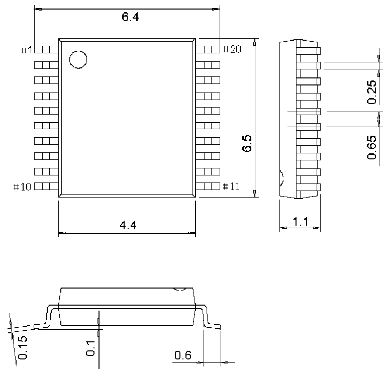
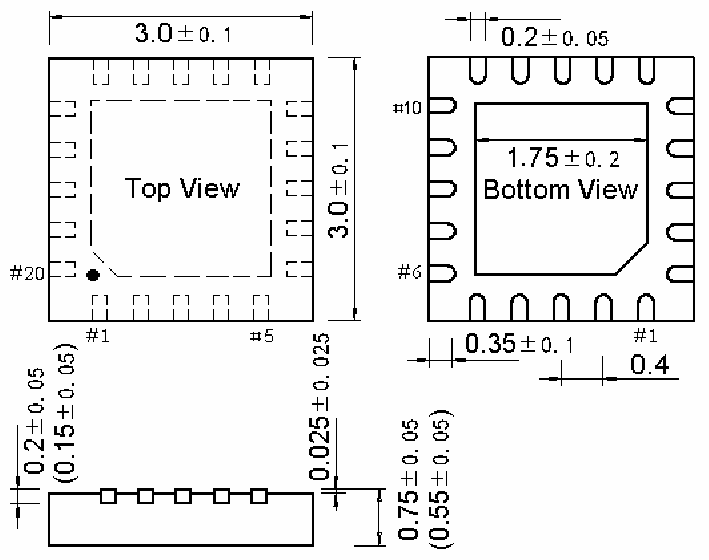

<!-- source-page: 32 -->

[← p.31](0031.md) · [index](../README.md) · [PDF p.32](https://ch32-riscv-ug.github.io/CH32V006/datasheet_zh/CH32V002DS0.PDF#page=32) · [p.33 →](0033.md)

<!-- header: CH32V002数据手册 https://wch.cn -->
说明：尺寸标注的单位是 mm（毫米），引脚中心间距总是标称值，没有误差，除此之外的尺寸误差不  
大于±0.2mm或者±10%两者中的较大值。  

图4-1 TSSOP20封装  
 <!-- rendered from the PDF; verify at https://ch32-riscv-ug.github.io/CH32V006/datasheet_zh/CH32V002DS0.PDF#page=32 -->

🖼 Text parsed from the figure above

<!-- image: p32-draw-image-00002 inside the figure -->

图4-2 QFN20封装  
 <!-- rendered from the PDF; verify at https://ch32-riscv-ug.github.io/CH32V006/datasheet_zh/CH32V002DS0.PDF#page=32 -->

🖼 Text parsed from the figure above

<!-- image: p32-draw-image-00003 inside the figure -->

<!-- image: p32-draw-image-00001 bbox=[502.92, 779.28, 522.36, 789.6] -->
<!-- footer: V1.7 30 -->
