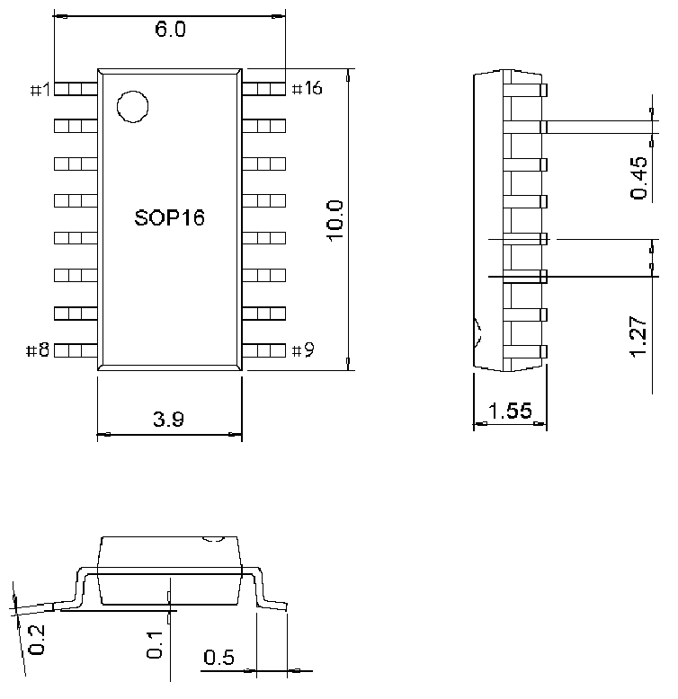
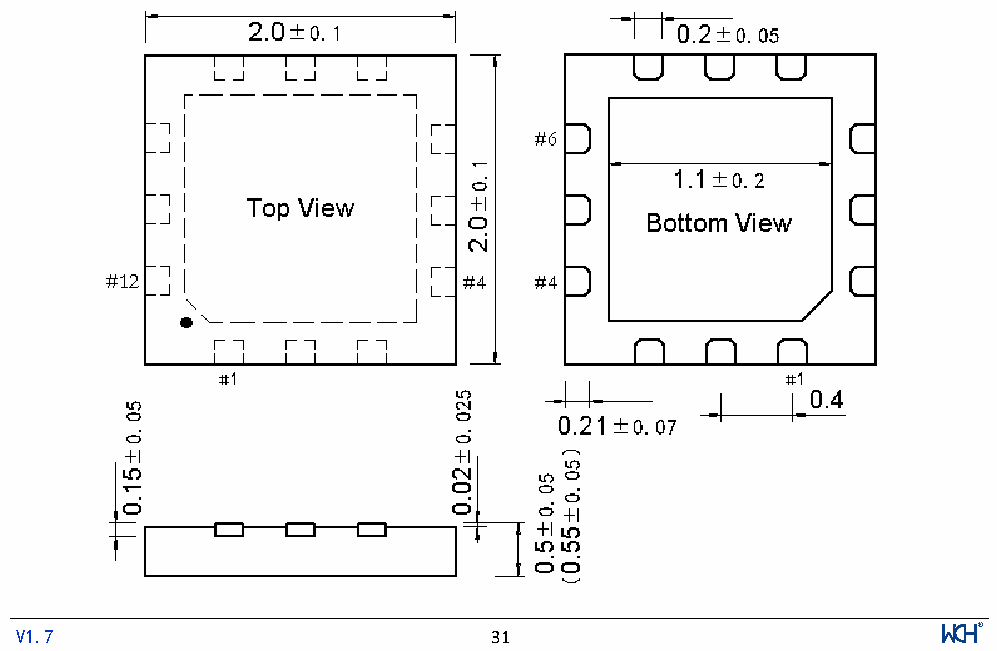

<!-- source-page: 33 -->

[← p.32](0032.md) · [index](../README.md) · [PDF p.33](https://ch32-riscv-ug.github.io/CH32V006/datasheet_zh/CH32V002DS0.PDF#page=33) · [p.34 →](0034.md)

<!-- header: CH32V002数据手册 https://wch.cn -->

图4-3 SOP16封装  
 <!-- rendered from the PDF; verify at https://ch32-riscv-ug.github.io/CH32V006/datasheet_zh/CH32V002DS0.PDF#page=33 -->

🖼 Text parsed from the figure above

<!-- image: p33-draw-image-00002 inside the figure -->

图4-4 QFN12封装  
 <!-- rendered from the PDF; verify at https://ch32-riscv-ug.github.io/CH32V006/datasheet_zh/CH32V002DS0.PDF#page=33 -->

🖼 Text parsed from the figure above

<!-- image: p33-draw-image-00003 inside the figure -->
<!-- image: p33-draw-image-00001 inside the figure -->
<!-- footer: V1.7 31 -->

