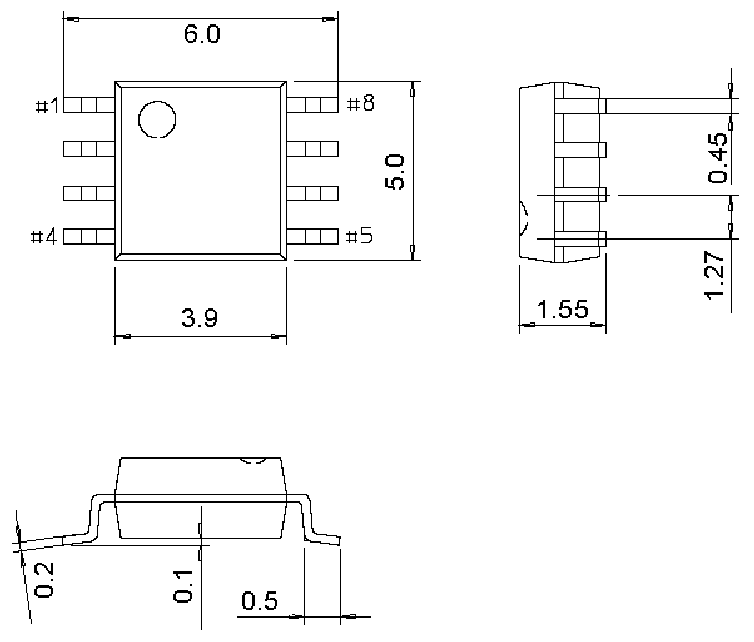

<!-- source-page: 34 -->

[← p.33](0033.md) · [index](../README.md) · [PDF p.34](https://ch32-riscv-ug.github.io/CH32V006/datasheet_zh/CH32V002DS0.PDF#page=34) · [p.35 →](0035.md)

<!-- header: CH32V002数据手册 https://wch.cn -->

图4-5 SOP8封装  
 <!-- rendered from the PDF; verify at https://ch32-riscv-ug.github.io/CH32V006/datasheet_zh/CH32V002DS0.PDF#page=34 -->

🖼 Text parsed from the figure above

<!-- image: p34-draw-image-00002 inside the figure -->

<!-- image: p34-draw-image-00001 bbox=[502.92, 779.28, 522.36, 789.6] -->
<!-- footer: V1.7 32 -->
