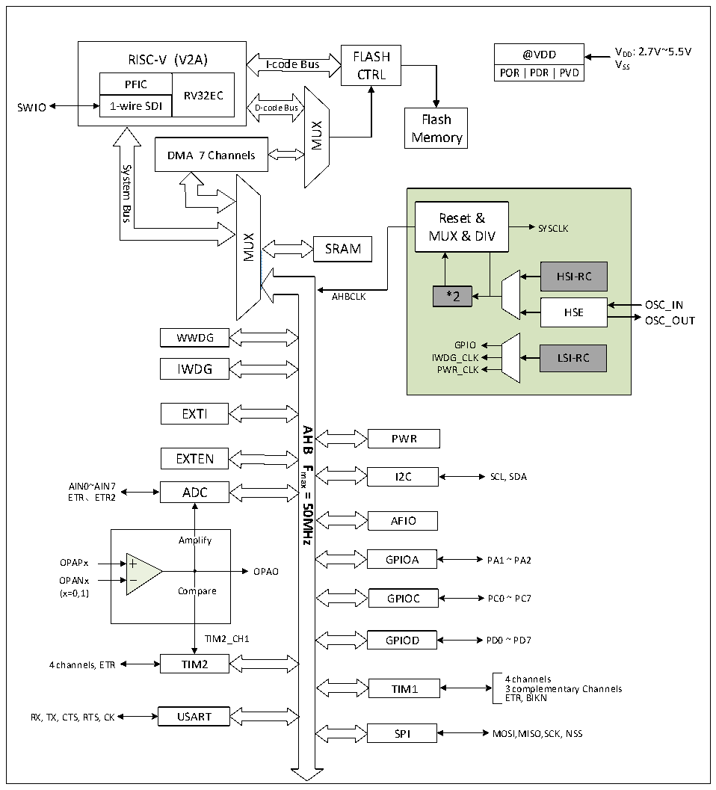

<!-- source-page: 3 -->

[← p.2](0002.md) · [index](../README.md) · [PDF p.3](https://ch32-riscv-ug.github.io/CH32V003/datasheet_en/CH32V003DS0.PDF#page=3) · [p.4 →](0004.md)

<!-- header: CH32V003 Datasheet http://wch-ic.com -->

# Chapter 1 Specification

## 1.1 System Architecture

The microcontroller is based on the RISC-V instruction set of QingKe V2A design, and its architecture  
includes the core, arbitration unit, DMA module, SRAM storage and other parts of the interaction through  
multiple groups of buses. The design integrates a general-purpose DMA controller to reduce CPU load and  
improve access efficiency, and also has data protection mechanisms and automatic clock switching protection  
to increase system stability. The following diagram shows the overall architecture of the product.  

Figure 1-1 System block diagram  
 <!-- rendered from the PDF; verify at https://ch32-riscv-ug.github.io/CH32V003/datasheet_en/CH32V003DS0.PDF#page=3 -->

🖼 Text parsed from the figure above

RISC-V (V2A)  PFIC  RV32EC  1-wire SDI  
@VDD V DD : 2.7V~5.5V  
RISC-V (V2A) FLASH  
VSS  
I-code Bus  
CTRL  
SWIO  
Flash  
MUX  
Memory  
DMA 7 Channels  
System  
<!-- image: p3-draw-image-00002 inside the figure -->
Bus  
Reset &amp;  
SYSCLK  
MUX &amp; DIV  
MUX  
SRAM  
HSI-RC  
*2  
AHBCLK  
OSC_IN  
HSE  
OSC_OUT  
WWDG  
GPIO  
IWDG_CLK LSI-RC  
IWDG PWR_CLK  
EXTI  
<strong>AHB</strong>  
PWR  
EXTEN  
<strong>Fmax</strong>  
I2C  
SCL, SDA  
AIN0~AIN7 ADC  
ETR、ETR2  
<strong>=</strong>  
<strong>50MHz</strong>  
AFIO  
Amplify  
OPAPx GPIOA PA1 ~ PA2  
OPAO  
OPANx  
(x=0,1) Compare GPIOC PC0 ~ PC7  
TIM2_CH1 GPIOD PD0 ~ PD7  
4 channels, ETR TIM2  
4 channels  
TIM1 3 complementary Channels  
ETR, BIKN  
RX, TX, CTS, RTS, CK USART  
SPI MOSI,MISO,SCK, NSS  

<!-- image: p3-draw-image-00001 bbox=[509.28, 783.48, 528.72, 793.8] -->
<!-- footer: V1.8 1 -->
