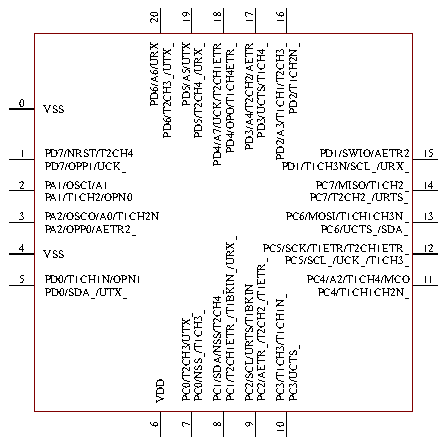

<!-- source-page: 12 -->

[← p.11](0011.md) · [index](../README.md) · [PDF p.12](https://ch32-riscv-ug.github.io/CH32V003/datasheet_en/CH32V003DS0.PDF#page=12) · [p.13 →](0013.md)

<!-- header: CH32V003 Datasheet http://wch-ic.com -->

# Chapter 2 Pinouts and Pin Definition

## 2.1 Pinouts

# CH32V003F4P6

1 20  
PD4/A7/UCK/T2CH1ETR/OPO/T1CH4ETR_ PD3/A4/T2CH2/AETR/UCTS/T1CH4_  
2 19  
PD5/A5/UTX/T2CH4_/URX_ PD2/A3/T1CH1/T2CH3_/T1CH2N_  
3 18  
PD6/A6/URX/T2CH3_/UTX_ PD1/SWIO/AETR2/T1CH3N/SCL_/URX_  
4 17  
PD7/NRST/T2CH4/OPP1/UCK_ PC7/MISO/T1CH2_/T2CH2_/URTS_  
5 16  
PA1/OSCI/A1/T1CH2/OPN0 PC6/MOSI/T1CH1CH3N_/UCTS_/SDA_  
6 15  
PA2/OSCO/A0/T1CH2N/OPP0/AETR2_ PC5/SCK/T1ETR/T2CH1ETR_/SCL_/UCK_/T1CH3_  
7 14  
VSS PC4/A2/T1CH4/MCO/T1CH1CH2N_  
8 13  
PD0/T1CH1N/OPN1/SDA_/UTX_ PC3/T1CH3/T1CH1N_/UCTS_  
9 12  
VDD PC2/SCL/URTS/T1BKIN/AETR_/T2CH2_/T1ETR_  
10 11  
PC0/T2CH3/UTX_/NSS_/T1CH3_ PC1/SDA/NSS/T2CH4_/T2CH1ETR_/T1BKIN_/URX_  

# CH32V003F4U6

 <!-- p12-cluster-01 uncaptioned graphics, rendered from the PDF; verify at https://ch32-riscv-ug.github.io/CH32V003/datasheet_en/CH32V003DS0.PDF#page=12 -->

🖼 Text parsed from the figure above

20 19  
18 17 16  
PD6/A6/URX PD6/T2CH3_/UTX_ PD5/A5/UTX  
PD5/T2CH4_/URX_  
PD4/OPO/T1CH4ETR_  
PD2/A3/T1CH1/T2CH3_  
PD2/T1CH2N_  
PD4/A7/UCK/T2CH1ETR  
PD3/A4/T2CH2/AETR  
PD3/UCTS/T1CH4_  
0 VSS  
1  
PD7/NRST/T2CH4 PD1/SWIO/AETR2  
15  
PD7/OPP1/UCK_ PD1/T1CH3N/SCL_/URX_  
2  
PA1/OSCI/A1 PC7/MISO/T1CH2_ 14  
PA1/T1CH2/OPN0 PC7/T2CH2_/URTS_  
3  
PA2/OSCO/A0/T1CH2N PC6/MOSI/T1CH1CH3N_ 13  
PA2/OPP0/AETR2_ PC6/UCTS_/SDA_  
PC1/T2CH1ETR_/T1BKIN_/URX_  
4 VSS  
PC5/SCK/T1ETR/T2CH1ETR_ 12 PC5/SCL_/UCK_/T1CH3_  
PC2/AETR_/T2CH2_/T1ETR_  
5  
PD0/T1CH1N/OPN1 PC4/A2/T1CH4/MCO  
11  
PC2/SCL/URTS/T1BKIN  
PD0/SDA_/UTX_ PC4/T1CH1CH2N_  
PC1/SDA/NSS/T2CH4_  
PC3/T1CH3/T1CH1N_  
PC0/NSS_/T1CH3_  
PC0/T2CH3/UTX_  
PC3/UCTS_  
VDD  
6 7 8 9 10  

# CH32V003A4M6

1 16  
PC1/SDA/NSS/T2CH4_/T2CH1ETR_/T1BKIN_/URX_ PC0/T2CH3/UTX_/NSS_/T1CH3_  
2 15  
PC2/SCL/URTS/T1BKIN/AETR_/T2CH2_/T1ETR_ VDD  
3 14  
PC3/T1CH3/T1CH1N_/UCTS_ VSS  
4 13  
PC4/A2/T1CH4/MCO/T1CH1CH2N_ PA2/OSCO/A0/T1CH2N/OPP0/AETR2_  
5 12  
PC6/MOSI/T1CH1CH3N_/UCTS_/SDA_ PA1/OSCI/A1/T1CH2/OPN0  
6 11  
PC7/MISO/T1CH2_/T2CH2_/URTS_ PD7/NRST/T2CH4/OPP1/UCK_  
7 10  
PD1/SWIO/AETR2/T1CH3N/SCL_/URX_ PD6/A6/URX/T2CH3_/UTX_  
8 9  
PD4/A7/UCK/T2CH1ETR/OPO/T1CH4ETR_ PD5/A5/UTX/T2CH4_/URX_  
<!-- image: p12-draw-image-00001 bbox=[502.44, 779.28, 521.88, 789.6] -->
<!-- footer: V1.8 10 -->
