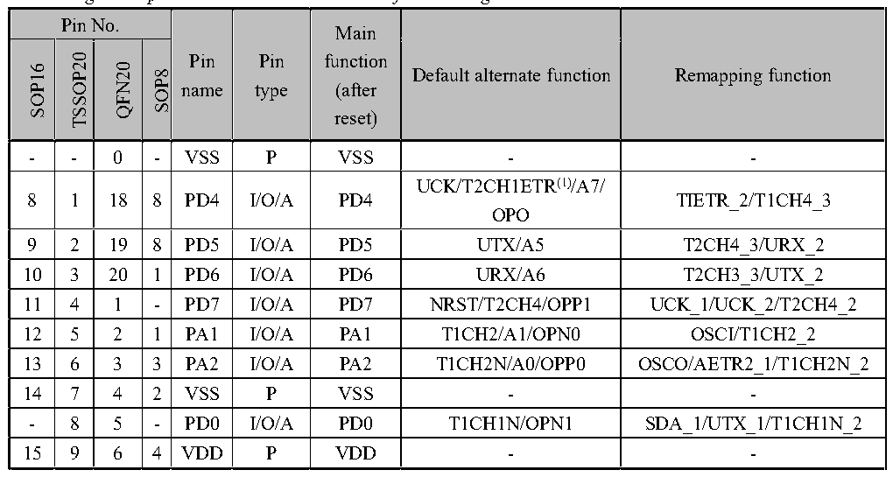

<!-- source-page: 13 -->

[← p.12](0012.md) · [index](../README.md) · [PDF p.13](https://ch32-riscv-ug.github.io/CH32V003/datasheet_en/CH32V003DS0.PDF#page=13) · [p.14 →](0014.md)

<!-- header: CH32V003 Datasheet http://wch-ic.com -->
CH32V003J4M6  
PD4/A7/UCK/T2CH1ETR/OPO/T1CH4ETR_  
1 PD6/A6/URX/T2CH3_/UTX_ PD5/A5/UTX/T2CH4_/URX_ 8  
PA1/OSCI/A1/T1CH2/OPN0 PD1/SWIO/AETR2/T1CH3N/SCL_/URX_  
2 7  
VSS PC4/A2/T1CH4/MCO/T1CH1CH2N_  
3 PC2/SCL/URTS/T1BKIN 6  
PA2/OSCO/A0/T1CH2N/OPP0/AETR2_  
PC2/AETR_/T2CH2_/T1ETR_  
4 5  
VDD PC1/SDA/NSS/T2CH4_/T2CH1ETR_/T1BKIN_/URX_  
<em>Note: The multiplexed functions in the pin diagram are abbreviated.</em>  
Example: A: ADC, A7 (ADC_IN7)  
T: TIME, T2CH4 (TIM2_CH4)  
U: USART, URX (USART_RX)  
OP: OPA, OPO (OPA_OUT), OPP1 (OPA_P1)  
OSCI (OSCIN)  
OSCO (OSCOUT)  
SDA (I2C_SDA)  
SCL (I2C_SCL)  
SCK (SPI_SCK)  
NSS (SPI_NSS)  
MOSI (SPI_MOSI)  
MISO (SPI_MISO)  
AETR(ADC_ETR)  

## 2.2 Pin Description

<em>Note: The pin function descriptions in the table below are for all functions and do not relate to specific model</em>  
<em>products. Peripheral resources may vary between models, so please check the availability of this function</em>  
<em>according to the product model resource table before viewing.</em>  

 <!-- p13-cluster-01 uncaptioned graphics, rendered from the PDF; verify at https://ch32-riscv-ug.github.io/CH32V003/datasheet_en/CH32V003DS0.PDF#page=13 -->

🖼 Text parsed from the figure above

<!-- p13-table-001 (table-2-1@1) -->
<table><caption>Table 2-1 Pin definitions</caption><tr><th colspan="4">Pin No.</th><th rowspan="2" style="text-align:left">Pin name 8POS</th><th rowspan="2" style="text-align:left">Pin type</th><th rowspan="2" style="text-align:left">Main function (after reset)</th><th rowspan="2">Default alternate function</th><th rowspan="2">Remapping function</th></tr><tr><td>SOP16</td><td>TSSOP20</td><td>QFN20</td><td>SOP8</td></tr><tr><td>-</td><td>-</td><td>0</td><td>-</td><td>VSS</td><td>P</td><td>VSS</td><td>-</td><td>-</td></tr><tr><td>8</td><td>1</td><td>18</td><td>8</td><td>PD4</td><td>I/O/A</td><td>PD4</td><td style="text-align:left">UCK/T2CH1ETR(1)/A7/ OPO</td><td>TIETR_2/T1CH4_3</td></tr><tr><td>9</td><td>2</td><td>19</td><td>8</td><td>PD5</td><td>I/O/A</td><td>PD5</td><td>UTX/A5</td><td>T2CH4_3/URX_2</td></tr><tr><td>10</td><td>3</td><td>20</td><td>1</td><td>PD6</td><td>I/O/A</td><td>PD6</td><td>URX/A6</td><td>T2CH3_3/UTX_2</td></tr><tr><td>11</td><td>4</td><td>1</td><td>-</td><td>PD7</td><td>I/O/A</td><td>PD7</td><td>NRST/T2CH4/OPP1</td><td>UCK_1/UCK_2/T2CH4_2</td></tr><tr><td>12</td><td>5</td><td>2</td><td>1</td><td>PA1</td><td>I/O/A</td><td>PA1</td><td>T1CH2/A1/OPN0</td><td>OSCI/T1CH2_2</td></tr><tr><td>13</td><td>6</td><td>3</td><td>3</td><td>PA2</td><td>I/O/A</td><td>PA2</td><td>T1CH2N/A0/OPP0</td><td>OSCO/AETR2_1/T1CH2N_2</td></tr><tr><td>14</td><td>7</td><td>4</td><td>2</td><td>VSS</td><td>P</td><td>VSS</td><td>-</td><td>-</td></tr><tr><td>-</td><td>8</td><td>5</td><td>-</td><td>PD0</td><td>I/O/A</td><td>PD0</td><td>T1CH1N/OPN1</td><td>SDA_1/UTX_1/T1CH1N_2</td></tr><tr><td>15</td><td>9</td><td>6</td><td>4</td><td>VDD</td><td>P</td><td>VDD</td><td>-</td><td>-</td></tr></table>

<!-- image: p13-draw-image-00001 bbox=[502.44, 779.28, 521.88, 789.6] -->
<!-- footer: V1.8 11 -->
