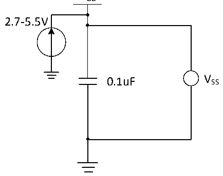

<!-- source-page: 16 -->

[← p.15](0015.md) · [index](../README.md) · [PDF p.16](https://ch32-riscv-ug.github.io/CH32V003/datasheet_en/CH32V003DS0.PDF#page=16) · [p.17 →](0017.md)

<!-- header: CH32V003 Datasheet http://wch.cn -->

# Chapter 3 Electrical Characteristics

## 3.1 Test Conditions

Unless otherwise specified and marked, all voltages are referenced to VSS.  
All minimum and maximum values are guaranteed in the worst conditions of ambient temperature, supply voltage  
and clock frequency. Typical values are based on normal temperature (25℃) and VDD= 3.3V or 5V environment,  
which are given only as design guidelines.  
The data based on comprehensive evaluation, design simulation or technology characteristics are not tested in  
production. On the basis of comprehensive evaluation, the minimum and maximum values refer to sample tests.  
Unless otherwise specified that is tested, the characteristic parameters are guaranteed by comprehensive evaluation  
or design.  
Power supply scheme:  

Figure 3-1 Typical circuit for conventional power supply  
 <!-- rendered from the PDF; verify at https://ch32-riscv-ug.github.io/CH32V003/datasheet_en/CH32V003DS0.PDF#page=16 -->

VDD  

🖼 Text parsed from the figure above

2.7-5.5V  
0.1uF V SS  

## 3.2 Absolute Maximum Ratings

Stresses at or above the absolute maximum ratings listed in the table below may cause permanent damage to  
the device.  

<!-- p16-table-001 (table-3-1@1) pages 16-17 -->
<table><caption>Table 3-1 Absolute maximum ratings</caption><tr><th>Symbol</th><th>Description</th><th>Min.</th><th>Max.</th><th>Unit</th></tr><tr><td style="text-align:left">TA</td><td>Ambient temperature during operation</td><td>-40</td><td>85</td><td>℃</td></tr><tr><td style="text-align:left">TS</td><td>Ambient temperature during storage</td><td>-40</td><td>125</td><td>℃</td></tr><tr><td style="text-align:left">V -V DD SS</td><td style="text-align:left">External main supply voltage (V ) DD</td><td>-0.3</td><td>5.5</td><td>V</td></tr><tr><td rowspan="2" style="text-align:left">VIN</td><td style="text-align:left">Input voltage on the FT (5V tolerant) pin</td><td style="text-align:left">V -0.3SS</td><td>5.5</td><td>V</td></tr><tr><td>Input voltage on other pins</td><td style="text-align:left">V -0.3SS</td><td style="text-align:left">V +0.3DD</td><td></td></tr><tr><td style="text-align:left">|△V | DD_x</td><td style="text-align:left">Variations between different main power supply pins</td><td></td><td>50</td><td>mV</td></tr><tr><td style="text-align:left">|△V | SS_x</td><td>Variations between different ground pins</td><td></td><td>50</td><td>mV</td></tr><tr><td style="text-align:left">VESD(HBM)</td><td style="text-align:left">Electrostatic discharge voltage (human body model, non-contact)</td><td>4K</td><td></td><td>V</td></tr><tr><td style="text-align:left">IVDD</td><td style="text-align:left">Total current into V power lines (supply current) DD</td><td></td><td>100</td><td rowspan="7">mA</td></tr><tr><td style="text-align:left">IVs</td><td style="text-align:left">Total current out of V ground lines (outflow current) SS</td><td></td><td>80</td></tr><tr><td rowspan="2" style="text-align:left">II/O</td><td>Sink current on any I/O and control pin</td><td></td><td>20</td></tr><tr><td style="text-align:left">Output current on any I/O and control pin</td><td></td><td>-20</td></tr><tr><td rowspan="2" style="text-align:left">IINJ(PIN)</td><td>OSC_IN pin of HSE</td><td></td><td>+/-4</td></tr><tr><td>Injected current on other pins</td><td></td><td>+/-4</td></tr><tr><td style="text-align:left">∑IINJ(PIN)</td><td style="text-align:left">Total injected current on all I/Os and control pins</td><td></td><td>+/-20</td></tr></table>

<!-- image: p16-draw-image-00001 bbox=[501.36, 779.28, 520.8, 789.6] -->
<!-- footer: V1.7 14 -->
