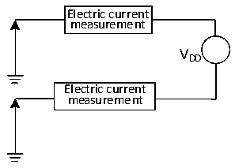

<!-- source-page: 18 -->

[← p.17](0017.md) · [index](../README.md) · [PDF p.18](https://ch32-riscv-ug.github.io/CH32V003/datasheet_en/CH32V003DS0.PDF#page=18) · [p.19 →](0019.md)

<!-- header: CH32V003 Datasheet http://wch.cn -->

> ⬆ **Table continued** — rendered in full at [page 17](0017.md). <!-- p18-table-001 -->

<em>Note: 1. Normal temperature test value.</em>  
<em>2. The user configuration bit RST_MODE can increase the power-on reset delay.</em>  

### 3.3.3 Embedded Reference Voltage

<!-- p18-table-002 (table-3-5@1) -->
<table><caption>Table 3-5 Embedded reference voltage</caption><tr><th>Symbol</th><th>Parameter</th><th>Condition</th><th>Min.</th><th>Typ.</th><th>Max.</th><th>Unit</th></tr><tr><td style="text-align:left">VREFINT</td><td>Internal reference voltage</td><td style="text-align:left">T = -40℃~85℃ A</td><td>1.17</td><td>1.2</td><td>1.23</td><td>V</td></tr><tr><td style="text-align:left">TS_vrefint</td><td style="text-align:left">ADC sampling time when reading the internal reference voltage</td><td></td><td>3</td><td></td><td>500</td><td style="text-align:left">1/f ADC</td></tr></table>

### 3.3.4 Supply Current Characteristics

Current consumption is a comprehensive index of a variety of parameters and factors. These parameters and  
factors include operating voltage, ambient temperature, I/O pin load, the software configuration of the  
product, the operating frequency, flip rate of the I/O pin, the location of the program in memory and the  
executed code, etc. The current consumption measurement method is as follows:  

Figure 3-2 Current consumption measurement  
 <!-- rendered from the PDF; verify at https://ch32-riscv-ug.github.io/CH32V003/datasheet_en/CH32V003DS0.PDF#page=18 -->

🖼 Text parsed from the figure above

Electric current  
measurement  
VDD  
Electric current  
measurement  

The microcontroller is in the following conditions:  
Normal temperature VDD = 3.3V or 5V case, when testing: all IO ports configured with pull-down inputs;  
HSI on when testing HSE, HSE off when testing HSI, HSE= 24M, HSI= 24M (calibrated); system clock  
source CLK*2 when FHCLK= 48MHz, 16MHz; clock on all peripherals only when turning on all peripherals.  
Enables or disables power consumption of all peripheral clocks.  
<!-- image: p18-draw-image-00001 bbox=[501.36, 779.28, 520.8, 789.6] -->
<!-- footer: V1.7 16 -->
