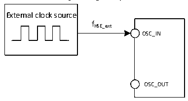
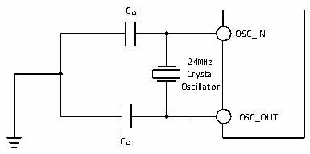

<!-- source-page: 21 -->

[← p.20](0020.md) · [index](../README.md) · [PDF p.21](https://ch32-riscv-ug.github.io/CH32V003/datasheet_en/CH32V003DS0.PDF#page=21) · [p.22 →](0022.md)

<!-- header: CH32V003 Datasheet http://wch.cn -->

> ⬆ **Table continued** — rendered in full at [page 20](0020.md). <!-- p21-table-001 -->

<em>Note: 1. Failure to meet this condition may cause level recognition error.</em>  

Figure 3-3 External high-frequency clock source circuit  
 <!-- rendered from the PDF; verify at https://ch32-riscv-ug.github.io/CH32V003/datasheet_en/CH32V003DS0.PDF#page=21 -->

🖼 Text parsed from the figure above

External clock source  
fHSE_ext  
OSC_IN  
OSC_OUT  

<!-- p21-table-002 (table-3-10@1) -->
<table><caption>Table 3-10 High-speed external clock generated from a crystal/ceramic resonator</caption><tr><th>Symbol</th><th>Parameter</th><th>Condition</th><th>Min.</th><th>Typ.</th><th>Max.</th><th>Unit</th></tr><tr><td style="text-align:left">FOSC_IN</td><td>Resonator frequency</td><td></td><td>4</td><td>24</td><td>25</td><td>MHz</td></tr><tr><td style="text-align:left">RF</td><td>Feedback resistance</td><td></td><td></td><td>250</td><td></td><td>kΩ</td></tr><tr><td>C</td><td style="text-align:left">Recommended load capacitance and corresponding crystal series impedance RS</td><td style="text-align:left">R = 60Ω(1) S</td><td></td><td>20</td><td></td><td>pF</td></tr><tr><td style="text-align:left">I2</td><td>HSE drive current</td><td style="text-align:left">V = 3.3V，20p load DD</td><td></td><td>0.32</td><td></td><td>mA</td></tr><tr><td style="text-align:left">g m</td><td>Oscillator transconductance</td><td>Startup</td><td></td><td>6.8</td><td></td><td>mA/V</td></tr><tr><td style="text-align:left">t SU(HSE)</td><td>Startup time</td><td style="text-align:left">V is stable, 24MDD crystal</td><td></td><td>2</td><td></td><td>ms</td></tr></table>

<em>Note 1: It is recommended that the ESR of 25M crystal should not exceed 60 Ω, and it can be relaxed if it is</em>  
<em>lower than 25M.</em>  
Circuit reference design and requirements:  
The load capacitance of the crystal is subject to the recommendation of the crystal manufacturer, generally  
CL1= CL2.  

Figure 3-4 Typical circuit of external 24M crystal  
 <!-- rendered from the PDF; verify at https://ch32-riscv-ug.github.io/CH32V003/datasheet_en/CH32V003DS0.PDF#page=21 -->

🖼 Text parsed from the figure above

CL1  
OSC_IN  
24MHz  
Crystal  
Oscillator  
OSC_OUT  
CL2  

<!-- image: p21-draw-image-00001 bbox=[501.36, 779.28, 520.8, 789.6] -->
<!-- footer: V1.7 19 -->
