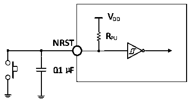

<!-- source-page: 24 -->

[← p.23](0023.md) · [index](../README.md) · [PDF p.24](https://ch32-riscv-ug.github.io/CH32V003/datasheet_en/CH32V003DS0.PDF#page=24) · [p.25 →](0025.md)

<!-- header: CH32V003 Datasheet http://wch.cn -->

<!-- p24-table-001 (table-3-18@1) -->
<table><caption>Table 3-18 Input/output AC characteristics</caption><tr><th style="text-align:left">MODEx[1:0] configuration</th><th>Symbol</th><th>Parameter</th><th>Condition</th><th>Min.</th><th>Max.</th><th>Unit</th></tr><tr><td rowspan="3" style="text-align:left">10 （2MHz）</td><td style="text-align:left">F max(I/O)out</td><td>Maximum frequency</td><td style="text-align:left">CL = 50pF, V = 2.7-5.5VDD</td><td></td><td>2</td><td>MHz</td></tr><tr><td style="text-align:left">t f(I/O)out</td><td>Output high to low fall time</td><td rowspan="2" style="text-align:left">CL = 50pF, V = 2.7-5.5VDD</td><td></td><td>125</td><td>ns</td></tr><tr><td style="text-align:left">t r(I/O)out</td><td>Output low to high rise time</td><td></td><td>125</td><td>ns</td></tr><tr><td rowspan="3" style="text-align:left">01 （10MHz）</td><td style="text-align:left">F max(I/O)out</td><td>Maximum frequency</td><td style="text-align:left">CL = 50pF, V = 2.7-5.5VDD</td><td></td><td>10</td><td>MHz</td></tr><tr><td style="text-align:left">t f(I/O)out</td><td>Output high to low fall time</td><td rowspan="2" style="text-align:left">CL = 50pF, V = 2.7-5.5VDD</td><td></td><td>25</td><td>ns</td></tr><tr><td style="text-align:left">t r(I/O)out</td><td>Output low to high rise time</td><td></td><td>25</td><td>ns</td></tr><tr><td rowspan="3" style="text-align:left">11 （30MHz）</td><td style="text-align:left">F max(I/O)out</td><td>Maximum frequency</td><td style="text-align:left">CL = 50pF, V = 2.7-5.5VDD</td><td></td><td>30</td><td>MHz</td></tr><tr><td style="text-align:left">t f(I/O)out</td><td>Output high to low fall time</td><td style="text-align:left">CL = 50pF, V = 2.7-5.5VDD</td><td></td><td>10</td><td>ns</td></tr><tr><td style="text-align:left">t r(I/O)out</td><td>Output low to high rise time</td><td style="text-align:left">CL = 50pF, V = 2.7-5.5VDD</td><td></td><td>10</td><td>ns</td></tr><tr><td></td><td style="text-align:left">t EXTIpw</td><td style="text-align:left">The EXTI controller detects the pulse width of the external signal</td><td></td><td>10</td><td></td><td>ns</td></tr></table>

### 3.3.10 NRST Pin Characteristics

<!-- p24-table-002 (table-3-19@1) -->
<table><caption>Table 3-19 External reset pin characteristics</caption><tr><th>Symbol</th><th>Parameter</th><th>Condition</th><th>Min.</th><th>Typ.</th><th>Max.</th><th>Unit</th></tr><tr><td style="text-align:left">VIL(NRST)</td><td style="text-align:left">NRST input low-level voltage</td><td></td><td>-0.3</td><td></td><td style="text-align:left">0.28*(V -1.8)+0.6DD</td><td>V</td></tr><tr><td style="text-align:left">VIH(NRST)</td><td style="text-align:left">NRST input high-level voltage</td><td></td><td style="text-align:left">0.41*(V -1.8)+1.3DD</td><td></td><td style="text-align:left">V +0.3DD</td><td>V</td></tr><tr><td style="text-align:left">V hys(NRST)</td><td style="text-align:left">NRST Schmitt Trigger voltage hysteresis</td><td></td><td>150</td><td></td><td></td><td>mV</td></tr><tr><td style="text-align:left">R (1) PU</td><td style="text-align:left">Weak pull-up equivalent resistance</td><td></td><td>35</td><td>45</td><td>55</td><td>kΩ</td></tr></table>

<em>Note: 1. The pull-up resistor is a real resistor in series with a switchable PMOS implementation. The</em>  
<em>resistance of this PMOS/NMOS switch is very small (approximately 10%).</em>  
Circuit reference design and requirements:  

Figure 3-5 Typical circuit of external reset pin  
 <!-- rendered from the PDF; verify at https://ch32-riscv-ug.github.io/CH32V003/datasheet_en/CH32V003DS0.PDF#page=24 -->

🖼 Text parsed from the figure above

<strong>VDD</strong>  
<strong>RPU</strong>  
<strong>NRST</strong>  
<strong>0.1μF</strong>  

### 3.3.11 TIM Timer Characteristics

<!-- p24-table-004 (table-3-20@1) pages 24-25 -->
<table><caption>Table 3-20 TIMx characteristics</caption><tr><th>Symbol</th><th>Parameter</th><th>Condition</th><th>Min.</th><th>Max.</th><th>Unit</th></tr><tr><td rowspan="2" style="text-align:left">t res(TIM)</td><td rowspan="2">Timer reference clock</td><td></td><td>1</td><td></td><td style="text-align:left">t TIMxCLK</td></tr><tr><td style="text-align:left">f = 48MHz TIMxCLK</td><td>20.8</td><td></td><td>ns</td></tr><tr><td rowspan="2" style="text-align:left">FEXT</td><td rowspan="2" style="text-align:left">Timer external clock frequency on CH1 to CH4</td><td></td><td>0</td><td style="text-align:left">f /2TIMxCLK</td><td>MHz</td></tr><tr><td style="text-align:left">f = 48MHz TIMxCLK</td><td>0</td><td>24</td><td>MHz</td></tr><tr><td style="text-align:left">R esTIM</td><td>Timer resolution</td><td></td><td></td><td>16</td><td>bit</td></tr><tr><td rowspan="2" style="text-align:left">t COUNTER</td><td rowspan="2" style="text-align:left">16-bit counter clock cycle when the internal clock is selected</td><td></td><td>1</td><td>65536</td><td style="text-align:left">t TIMxCLK</td></tr><tr><td style="text-align:left">f = 48MHz TIMxCLK</td><td>0.0208</td><td>1363</td><td>us</td></tr><tr><td rowspan="2" style="text-align:left">t MAX_COUNT</td><td rowspan="2">Maximum possible count</td><td></td><td></td><td>65535</td><td style="text-align:left">t TIMxCLK</td></tr><tr><td style="text-align:left">f = 48MHz TIMxCLK</td><td></td><td>1363</td><td>s</td></tr></table>

<!-- image: p24-draw-image-00001 bbox=[501.36, 779.28, 520.8, 789.6] -->
<!-- footer: V1.7 22 -->
