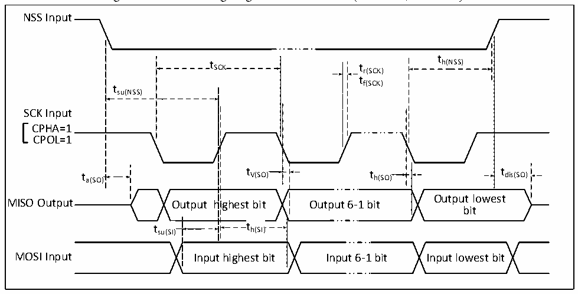

<!-- source-page: 28 -->

[← p.27](0027.md) · [index](../README.md) · [PDF p.28](https://ch32-riscv-ug.github.io/CH32V003/datasheet_en/CH32V003DS0.PDF#page=28) · [p.29 →](0029.md)

<!-- header: CH32V003 Datasheet http://wch.cn -->

Figure 3-9-1 SPI timing diagram in Slave mode (CPHA=1, CPOL=1)  
 <!-- rendered from the PDF; verify at https://ch32-riscv-ug.github.io/CH32V003/datasheet_en/CH32V003DS0.PDF#page=28 -->

🖼 Text parsed from the figure above

NSS Input  
t  
t SCK t r(SCK) h(NSS)  
tf(SCK)  
tsu(NSS)  
SCK Input  
CPHA=1  
CPOL=1  
t a(SO) t V(SO) t h(SO) t dis(SO)  
Output lowest  
MISO Output Output highest bit Output 6-1 bit  
bit  
t su(SI)  
t h(SI)  th(SI)  
MOSI Input Input highest bit Input 6-1 bit Input lowest bit  

<!-- p28-table-003 (table-3-22@1) -->
<table><caption>Table 3-22 SPI interface characteristics</caption><tr><th>Symbol</th><th>Parameter</th><th>Condition</th><th>Min.</th><th>Max.</th><th>Unit</th></tr><tr><td rowspan="2" style="text-align:left">f /t SCK SCK</td><td rowspan="2">SPI clock frequency</td><td>Master mode</td><td></td><td>24</td><td>MHz</td></tr><tr><td>Slave mode</td><td></td><td>24</td><td>MHz</td></tr><tr><td style="text-align:left">t /t r(SCK) f(SCK)</td><td>SPI clock rise and fall time</td><td>Load capacitance: C = 30pF</td><td></td><td>20</td><td>ns</td></tr><tr><td style="text-align:left">t SU(NSS)</td><td>NSS setup time</td><td>Slave mode</td><td style="text-align:left">2t PCLK</td><td></td><td>ns</td></tr><tr><td style="text-align:left">t h(NSS)</td><td>NSS hold time</td><td>Slave mode</td><td style="text-align:left">2t PCLK</td><td></td><td>ns</td></tr><tr><td style="text-align:left">t /t w(SCKH) w(SCKL)</td><td>SCK high and low time</td><td style="text-align:left">Master mode, f = 48MHz, PCLK Prescaler factor = 2</td><td>30</td><td>70</td><td>ns</td></tr><tr><td style="text-align:left">t SU(MI)</td><td rowspan="2">Data input setup time</td><td>Master mode</td><td>5</td><td></td><td>ns</td></tr><tr><td style="text-align:left">t SU(SI)</td><td>Slave mode</td><td>5</td><td></td><td>ns</td></tr><tr><td style="text-align:left">t h(MI)</td><td rowspan="2">Data input hold time</td><td>Master mode</td><td>5</td><td></td><td>ns</td></tr><tr><td style="text-align:left">t h(SI)</td><td>Slave mode</td><td>4</td><td></td><td>ns</td></tr><tr><td style="text-align:left">t a(SO)</td><td>Data output access time</td><td style="text-align:left">Slave mode, f = 24MHz PCLK</td><td>0</td><td style="text-align:left">1t PCLK</td><td>ns</td></tr><tr><td style="text-align:left">t dis(SO)</td><td>Data output disable time</td><td>Slave mode</td><td>0</td><td>10</td><td>ns</td></tr><tr><td style="text-align:left">t V(SO)</td><td rowspan="2">Data output valid time</td><td>Slave mode (After enable edge)</td><td></td><td>5</td><td>ns</td></tr><tr><td style="text-align:left">t V(MO)</td><td>Master mode (After enable edge)</td><td></td><td>5</td><td>ns</td></tr><tr><td style="text-align:left">t h(SO)</td><td rowspan="2">Data output hold time</td><td>Slave mode (After enable edge)</td><td>2</td><td></td><td>ns</td></tr><tr><td style="text-align:left">t h(MO)</td><td>Master mode (After enable edge)</td><td>0</td><td></td><td>ns</td></tr></table>

### 3.3.14 10-bit ADC Characteristics

<!-- p28-table-004 (table-3-23@1) pages 28-29 -->
<table><caption>Table 3-23 ADC characteristics</caption><tr><th>Symbol</th><th>Parameter</th><th>Condition</th><th>Min.</th><th>Typ.</th><th>Max.</th><th>Unit</th></tr><tr><td style="text-align:left">VDD</td><td>Supply voltage</td><td></td><td>2.8</td><td></td><td>5.5</td><td>V</td></tr><tr><td style="text-align:left">IDD</td><td>Supply current</td><td></td><td></td><td>370</td><td></td><td>uA</td></tr><tr><td rowspan="3" style="text-align:left">f ADC</td><td rowspan="3">ADC clock frequency</td><td style="text-align:left">V = 2.8 to 5.5VDD</td><td>1</td><td></td><td>6</td><td rowspan="3">MHz</td></tr><tr><td style="text-align:left">V = 3.2 to 5.5VDD</td><td>1</td><td></td><td>12</td></tr><tr><td style="text-align:left">V = 4.5 to 5.5VDD</td><td>1</td><td></td><td>24</td></tr><tr><td style="text-align:left">VAIN</td><td>Conversion voltage range</td><td></td><td style="text-align:left">VSS</td><td></td><td style="text-align:left">VDD</td><td>V</td></tr><tr><td style="text-align:left">CADC</td><td style="text-align:left">Internal sample and hold capacitor</td><td></td><td></td><td>3</td><td></td><td>pF</td></tr><tr><td style="text-align:left">RADC</td><td>Sampling switch resistance</td><td></td><td></td><td>0.6</td><td>1.5</td><td>kΩ</td></tr><tr><td rowspan="4" style="text-align:left">f S</td><td rowspan="4">Sampling rate</td><td style="text-align:left">f = 4 MHz ADC</td><td></td><td></td><td>285</td><td rowspan="4">KHz</td></tr><tr><td style="text-align:left">f = 6 MHz ADC</td><td></td><td></td><td>430</td></tr><tr><td style="text-align:left">f = 12 MHz ADC</td><td></td><td></td><td>857</td></tr><tr><td style="text-align:left">f = 24 MHz ADC</td><td></td><td></td><td>1710</td></tr><tr><td rowspan="3" style="text-align:left">t s</td><td rowspan="3">Sampling time</td><td style="text-align:left">f = 4 MHz ADC</td><td></td><td>0.75</td><td></td><td rowspan="3">us</td></tr><tr><td style="text-align:left">f = 6 MHz ADC</td><td></td><td>0.5</td><td></td></tr><tr><td style="text-align:left">f = 12 MHz ADC</td><td></td><td>0.25</td><td></td></tr><tr><td style="text-align:left">t STAB</td><td>Power-on time</td><td></td><td></td><td>7</td><td></td><td>us</td></tr><tr><td rowspan="4" style="text-align:left">t CONV</td><td rowspan="4" style="text-align:left">Total conversion time (including sampling time)</td><td style="text-align:left">f = 4 MHz ADC</td><td>3.5</td><td></td><td></td><td>us</td></tr><tr><td style="text-align:left">f = 6 MHz ADC</td><td>2.33</td><td></td><td></td><td>us</td></tr><tr><td style="text-align:left">f = 12 MHz ADC</td><td>1.17</td><td></td><td></td><td>us</td></tr><tr><td>-</td><td colspan="3">14</td><td style="text-align:left">1/f ADC</td></tr></table>

<!-- image: p28-draw-image-00001 bbox=[501.36, 779.28, 520.8, 789.6] -->
<!-- footer: V1.7 26 -->
