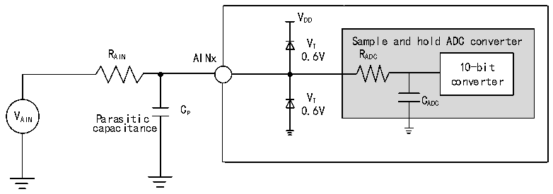
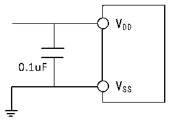

<!-- source-page: 30 -->

[← p.29](0029.md) · [index](../README.md) · [PDF p.30](https://ch32-riscv-ug.github.io/CH32V003/datasheet_en/CH32V003DS0.PDF#page=30) · [p.31 →](0031.md)

<!-- header: CH32V003 Datasheet http://wch.cn -->

> ⬆ **Table continued** — rendered in full at [page 29](0029.md). <!-- p30-table-001 -->

<em>Note: Source simulation.</em>  
Cp represents the parasitic capacitance on the PCB and the pad (about 5pF), which may be related to the  
quality of the pad and PCB layout. A larger Cp value will reduce the conversion accuracy, the solution is to  
reduce the fADC value.  

Figure 3-10 ADC typical connection diagram  
 <!-- rendered from the PDF; verify at https://ch32-riscv-ug.github.io/CH32V003/datasheet_en/CH32V003DS0.PDF#page=30 -->

🖼 Text parsed from the figure above

VDD  
VT Sample and hold ADC converter  
R AIN AINx 0.6V R ADC  
10-bit  
converter  
V AIN Parasitic C P 0 V . T 6V C ADC  
capacitance  

Figure 3-11 Analog power supply and decoupling circuit reference  
 <!-- rendered from the PDF; verify at https://ch32-riscv-ug.github.io/CH32V003/datasheet_en/CH32V003DS0.PDF#page=30 -->

🖼 Text parsed from the figure above

VDD  
0.1uF  
VSS  

### 3.3.15 OPA Characteristics

<!-- p30-table-002 (table-3-26@1) pages 30-31 -->
<table><caption>Table 3-26 OPA characteristics</caption><tr><th>Symbol</th><th>Parameter</th><th>Condition</th><th>Min.</th><th>Typ.</th><th>Max.</th><th>Unit</th></tr><tr><td style="text-align:left">VDD</td><td>Supply voltage</td><td></td><td>2.8</td><td></td><td>5.5</td><td>V</td></tr><tr><td style="text-align:left">CMIR</td><td style="text-align:left">Common mode input voltage</td><td></td><td>0</td><td></td><td style="text-align:left">VDD</td><td>V</td></tr><tr><td style="text-align:left">VIOFFSET</td><td>Input offset voltage</td><td></td><td></td><td>±3</td><td>±13</td><td>mV</td></tr><tr><td style="text-align:left">ILOAD</td><td>Drive current</td><td></td><td></td><td></td><td>1.5</td><td>mA</td></tr><tr><td style="text-align:left">IDDOPAMP</td><td>Current consumption</td><td>No load, static mode</td><td></td><td>273</td><td></td><td>uA</td></tr><tr><td style="text-align:left">C (1) MRR</td><td style="text-align:left">Common mode rejection ratio</td><td>@1KHz</td><td></td><td>81</td><td></td><td>dB</td></tr><tr><td style="text-align:left">P (1) SRR</td><td>Power supply rejection ratio</td><td>@1KHz</td><td></td><td>88</td><td></td><td>dB</td></tr><tr><td style="text-align:left">A (1) V</td><td>Open loop gain</td><td style="text-align:left">C = 50pFLOAD</td><td></td><td>105</td><td></td><td>dB</td></tr><tr><td style="text-align:left">G (1) BW</td><td>Unit gain bandwidth</td><td style="text-align:left">C = 50pFLOAD</td><td></td><td>12</td><td></td><td>MHz</td></tr><tr><td style="text-align:left">P (1) M</td><td>Phase margin</td><td style="text-align:left">C = 50pFLOAD</td><td></td><td>75</td><td></td><td>deg</td></tr><tr><td style="text-align:left">S (1) R</td><td>Slew rate limited</td><td style="text-align:left">C = 50pFLOAD</td><td></td><td>7.7</td><td></td><td>V/us</td></tr><tr><td style="text-align:left">t (1) WAKUP</td><td style="text-align:left">Setup time from shutdown to wake up, 0.1%</td><td style="text-align:left">Input V /2, C =50pF,R =4kΩ DD LOAD LOAD</td><td></td><td>520</td><td></td><td>ns</td></tr><tr><td style="text-align:left">RLOAD</td><td>Resistive load</td><td></td><td>4</td><td></td><td></td><td>kΩ</td></tr><tr><td style="text-align:left">CLOAD</td><td>Capacitive load</td><td></td><td></td><td></td><td>50</td><td>pF</td></tr><tr><td rowspan="2" style="text-align:left">V (2) OHSAT</td><td rowspan="2" style="text-align:left">High saturation output voltage</td><td style="text-align:left">R = 4kΩ, input V LOAD DD</td><td style="text-align:left">V -180DD</td><td></td><td></td><td rowspan="2">mV</td></tr><tr><td style="text-align:left">R = 20kΩ, input V LOAD DD</td><td style="text-align:left">V -36DD</td><td></td><td></td></tr><tr><td rowspan="2" style="text-align:left">V (2) OLSAT</td><td rowspan="2" style="text-align:left">Low saturation output voltage</td><td style="text-align:left">R = 4kΩ, input 0LOAD</td><td></td><td></td><td>5</td><td rowspan="2">mV</td></tr><tr><td style="text-align:left">R = 20kΩ, input 0LOAD</td><td></td><td></td><td>5</td></tr><tr><td rowspan="2">EN(1)</td><td rowspan="2" style="text-align:left">Equivalent input voltage noise</td><td style="text-align:left">R = 4kΩ, @1KHz LOAD</td><td></td><td>83</td><td></td><td rowspan="2" style="text-align:left">nv Hz</td></tr><tr><td style="text-align:left">R = 4kΩ, @10KHz LOAD</td><td></td><td>28</td><td></td></tr></table>

<!-- image: p30-draw-image-00001 bbox=[501.36, 779.28, 520.8, 789.6] -->
<!-- footer: V1.7 28 -->
