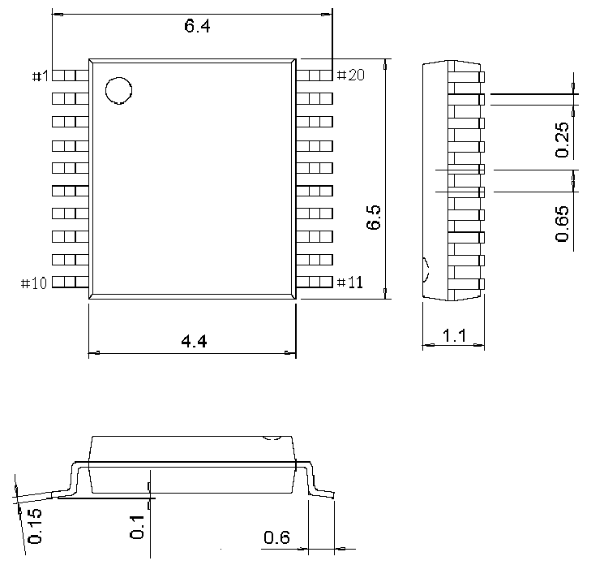
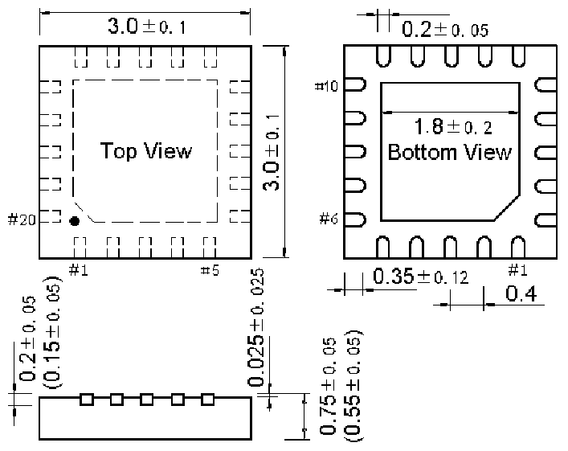

<!-- source-page: 33 -->

[← p.32](0032.md) · [index](../README.md) · [PDF p.33](https://ch32-riscv-ug.github.io/CH32V003/datasheet_en/CH32V003DS0.PDF#page=33) · [p.34 →](0034.md)

<!-- header: CH32V003 Datasheet https://wch-ic.com -->
<em>Note: All dimensions are in millimeters. The pin center spacing values are nominal values, with no error.</em>  
<em>Other than that, the dimensional error is not greater than the greater of ±0.2mm or 10%.</em>  

## 4.1 TSSOP20 package

 <!-- p33-draw-image-00002 rendered from the PDF -->

## 4.2 QFN20 package

 <!-- p33-draw-image-00003 rendered from the PDF -->

<!-- image: p33-draw-image-00001 bbox=[502.92, 779.28, 522.36, 789.6] -->
<!-- footer: V1.8 31 -->
