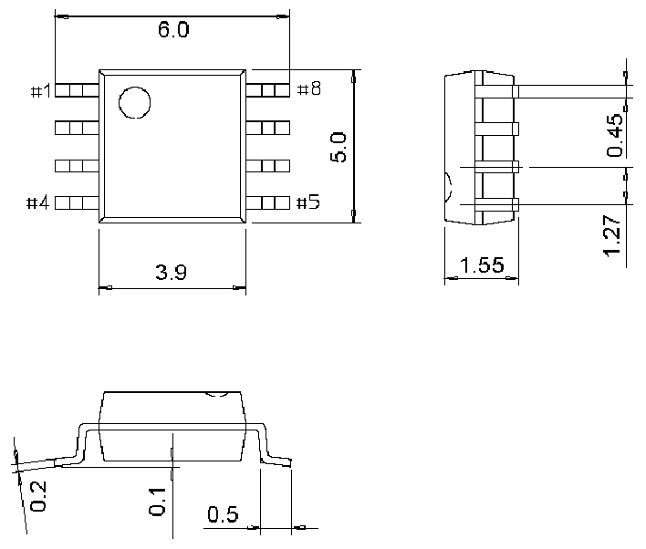

<!-- source-page: 35 -->

[← p.34](0034.md) · [index](../README.md) · [PDF p.35](https://ch32-riscv-ug.github.io/CH32V003/datasheet_en/CH32V003DS0.PDF#page=35) · [p.36 →](0036.md)

<!-- header: CH32V003 Datasheet https://wch-ic.com -->

## 4.4 SOP8 package

 <!-- p35-draw-image-00002 rendered from the PDF -->

<!-- image: p35-draw-image-00001 bbox=[502.92, 779.28, 522.36, 789.6] -->
<!-- footer: V1.8 33 -->
