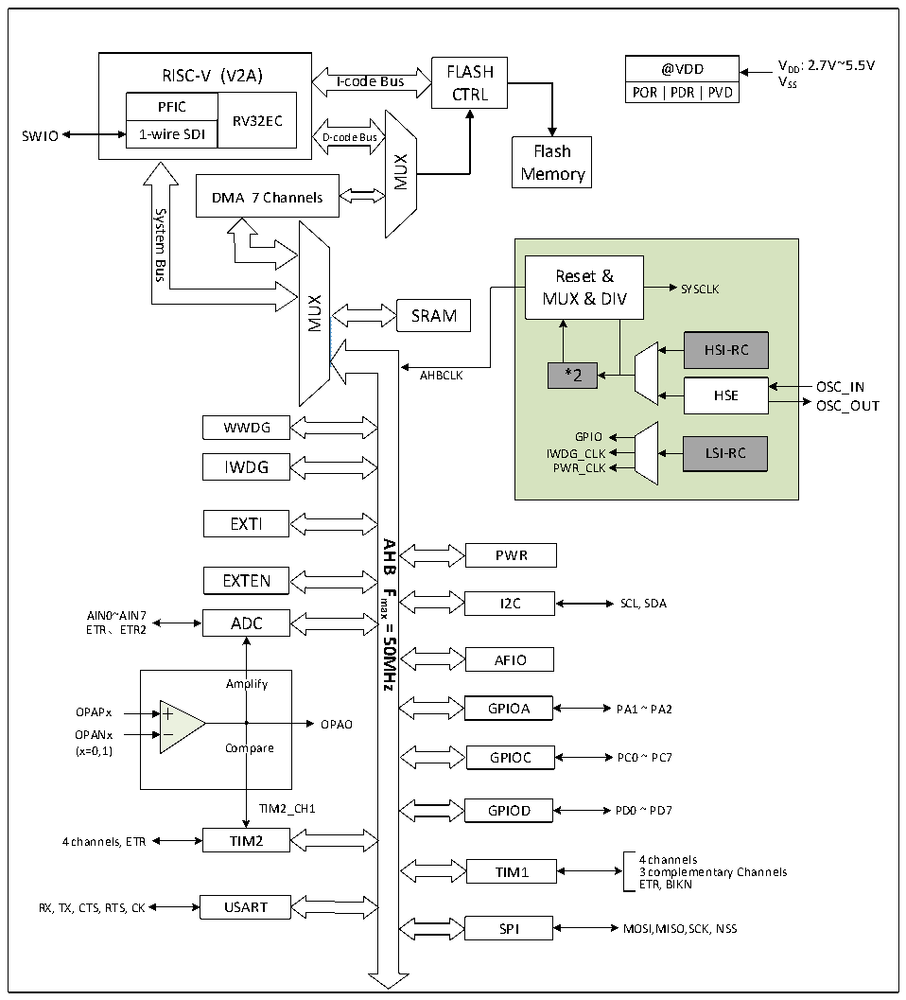

<!-- source-page: 2 -->

[← p.1](0001.md) · [index](../README.md) · [PDF p.2](https://ch32-riscv-ug.github.io/CH32V003/datasheet_zh/CH32V003DS0.PDF#page=2) · [p.3 →](0003.md)

<!-- header: CH32V003数据手册 https://wch.cn -->

# 第 1 章 规格信息

## 1.1 系统架构

微控制器基于RISC-V指令集的青稞V2A设计，其架构中将内核、仲裁单元、DMA模块、SRAM存储  
等部分通过多组总线实现交互。设计中集成通用DMA控制器以减轻CPU负担、提高访问效率，同时兼  
有数据保护机制，时钟自动切换保护等措施增加了系统稳定性。下图是系列产品内部总体架构框图。  

图1-1 系统框图  
 <!-- rendered from the PDF; verify at https://ch32-riscv-ug.github.io/CH32V003/datasheet_zh/CH32V003DS0.PDF#page=2 -->

🖼 Text parsed from the figure above

RISC-V (V2A)  PFIC  RV32EC  1-wire SDI  
@VDD V DD : 2.7V~5.5V  
RISC-V (V2A) FLASH  
VSS  
I-code Bus  
CTRL  
SWIO  
Flash  
MUX  
Memory  
DMA 7 Channels  
System  
<!-- image: p2-draw-image-00002 inside the figure -->
Bus  
Reset &amp;  
SYSCLK  
MUX &amp; DIV  
MUX  
SRAM  
HSI-RC  
*2  
AHBCLK  
OSC_IN  
HSE  
OSC_OUT  
WWDG  
GPIO  
IWDG_CLK LSI-RC  
IWDG PWR_CLK  
EXTI  
<strong>AHB</strong>  
PWR  
EXTEN  
<strong>Fmax</strong>  
I2C  
SCL, SDA  
AIN0~AIN7 ADC  
ETR、ETR2  
<strong>=</strong>  
<strong>50MHz</strong>  
AFIO  
Amplify  
OPAPx GPIOA PA1 ~ PA2  
OPAO  
OPANx  
(x=0,1) Compare GPIOC PC0 ~ PC7  
TIM2_CH1 GPIOD PD0 ~ PD7  
4 channels, ETR TIM2  
4 channels  
TIM1 3 complementary Channels  
ETR, BIKN  
RX, TX, CTS, RTS, CK USART  
SPI MOSI,MISO,SCK, NSS  

<!-- image: p2-draw-image-00001 bbox=[516.72, 779.28, 536.16, 789.6] -->
<!-- footer: V1.8 1 -->
