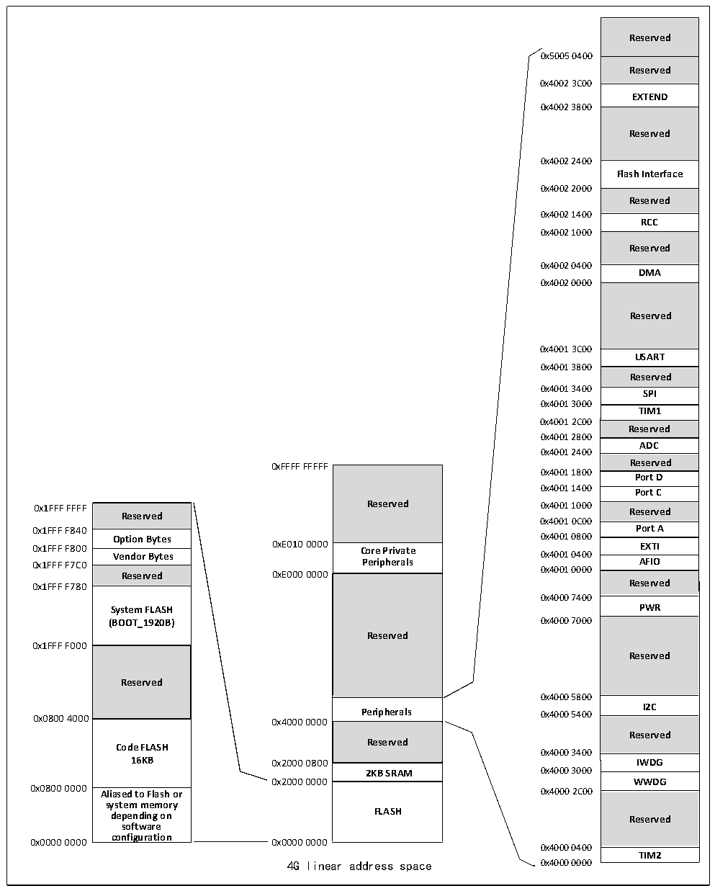

<!-- source-page: 3 -->

[← p.2](0002.md) · [index](../README.md) · [PDF p.3](https://ch32-riscv-ug.github.io/CH32V003/datasheet_zh/CH32V003DS0.PDF#page=3) · [p.4 →](0004.md)

<!-- header: CH32V003数据手册 https://wch.cn -->

## 1.2 存储器映射表

图1-2 存储器地址映射  
 <!-- rendered from the PDF; verify at https://ch32-riscv-ug.github.io/CH32V003/datasheet_zh/CH32V003DS0.PDF#page=3 -->

🖼 Text parsed from the figure above

Reserved  Reserved  EXTEND  Reserved  Flash Interface  Reserved  RCC  Reserved  DMA  Reserved  USART  Reserved  
0x5005 0400  
0x4002 3C00  
0x4002 3800  
0x4002 2400  
0x4002 2000  
0x4002 1400  
0x4002 1000  
0x4002 0400  
0x4002 0000  
0x4001 3C00  
0x4001 3800  
0x4001 3400  
<strong>SPI</strong>  
0x4001 3000  
<strong>TIM1</strong>  
0x4001 2C00  
<strong>Reserved</strong>  
0x4001 2800  
<strong>ADC</strong>  
0x4001 2400  
0xFFFF FFFFF Reserved  
Reserved  Core Private Peripherals  Reserved  
<strong>0x4001 1800 Port D</strong>  
0x4001 1400  
Port C  Reserved  Port A  EXTI  AFIO  Reserved  PWR  Reserved  
Reserved  Option Bytes  Vendor Bytes  Reserved  System FLASH (BOOT_1920B)  Reserved  Code FLASH16KB Aliased to Flash or  Aliased to Flash or system memory depending on software configuration  
0x4001 0C00  
0x4001 0000  
Reserved 0xE000 0000  
0x4000 7400  
0x1FFF F000  
0x4000 5800  
<strong>I2C</strong>  
0x0800 4000 0x4000 0000 Peripherals 0x4000 5400  
Reserved  2KB SRAM  FLASH  
<strong>Reserved</strong>  
0x4000 3400  
2KB SRAM 0x4000 3000  
0x2000 0000 WWDG  
0x0800 0000 Aliased to Flash or 0x4000 2C00  
Reserved  TIM2  
0x4000 0400  
4G linear address space 0x4000 0000  

<!-- image: p3-draw-image-00001 bbox=[507.72, 779.28, 527.16, 789.6] -->
<!-- footer: V1.8 2 -->
