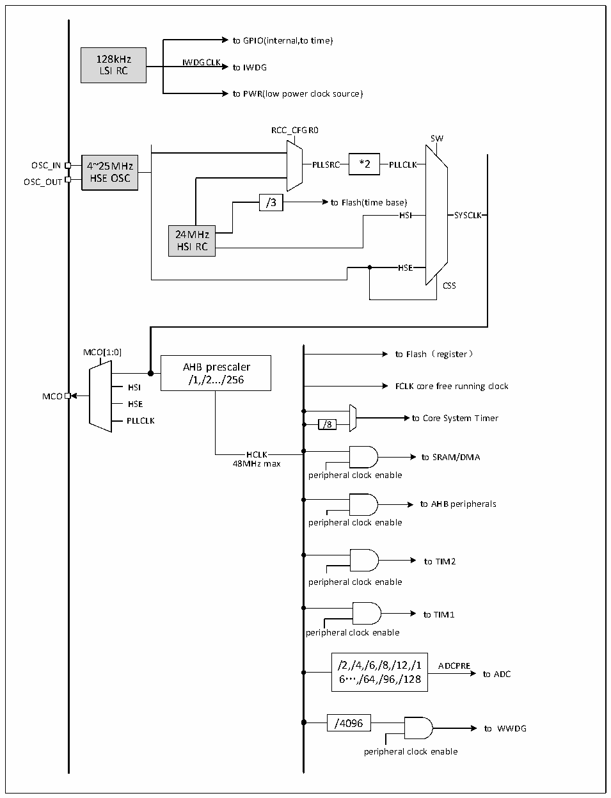

<!-- source-page: 4 -->

[← p.3](0003.md) · [index](../README.md) · [PDF p.4](https://ch32-riscv-ug.github.io/CH32V003/datasheet_zh/CH32V003DS0.PDF#page=4) · [p.5 →](0005.md)

<!-- header: CH32V003数据手册 https://wch.cn -->

## 1.3 时钟树

系统中引入3组时钟源：内部高频RC振荡器（HSI）、内部低频RC振荡器(LSI)、外接高频振荡器  
(HSE)。其中，低频时钟源为独立看门狗提供了时钟基准。高频时钟源直接或者间接通过2倍频后输出  
为系统总线时钟（SYSCLK），系统时钟再由各预分频器提供了AHB域外设控制时钟及采样或接口输出时  
钟，部分模块工作需要由PLL时钟直接提供。  

图1-3 时钟树框图  
 <!-- rendered from the PDF; verify at https://ch32-riscv-ug.github.io/CH32V003/datasheet_zh/CH32V003DS0.PDF#page=4 -->

🖼 Text parsed from the figure above

to GPIO(internal,to time)  
128kHz IWDGCLK  
LSI RC to IWDG  
to PWR(low power clock source)  
RCC_CFGR0  
SW  
OSC_IN 4~25MHz PLLSRC *2 PLLCLK  
HSE OSC  
OSC_OUT  
/3 to Flash(time base)  
HS  HS  
SYSCLK  SYSCLK  
HSI SYSCLK  
24MHz  
HSI RC  
HSE  HSE  
CSS  
MCO[1:0] to Flash（register）  
AHB prescaler  
/1,/2.../256  
HSI FCLK core free running clock  
MCO  
HSE  
PLLCLK /8 to Core System Timer  
HCLK to SRAM/DMA  
48MHz max  
peripheral clock enable  
to AHB peripherals  
peripheral clock enable  
to TIM2  
peripheral clock enable  
to TIM1  
peripheral clock enable  
/2,/4,/6,/8,/12,/1 ADCPRE  
6…,/64,/96,/128 to ADC  
/4096  
to WWDG  
peripheral clock enable  

<!-- image: p4-draw-image-00001 bbox=[507.72, 779.28, 527.16, 789.6] -->
<!-- footer: V1.8 3 -->
