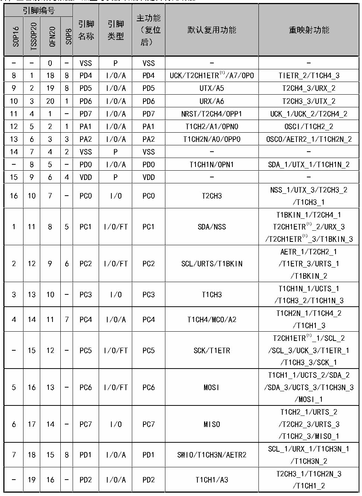

<!-- source-page: 11 -->

[← p.10](0010.md) · [index](../README.md) · [PDF p.11](https://ch32-riscv-ug.github.io/CH32V003/datasheet_zh/CH32V003DS0.PDF#page=11) · [p.12 →](0012.md)

<!-- header: CH32V003数据手册 https://wch.cn -->

## 2.2 引脚描述

注意，下表中的引脚功能描述针对的是所有功能，不涉及具体型号产品。不同型号之间外设资源有差  
异，查看前请先根据产品型号资源表确认是否有此功能。  

 <!-- p11-cluster-01 uncaptioned graphics, rendered from the PDF; verify at https://ch32-riscv-ug.github.io/CH32V003/datasheet_zh/CH32V003DS0.PDF#page=11 -->

🖼 Text parsed from the figure above

<!-- p11-table-001 (table-2-1@1) -->
<table><caption>表2-1 引脚定义</caption><tr><th colspan="4">引脚编号</th><th rowspan="2" style="text-align:left">引脚名称</th><th rowspan="2" style="text-align:left">引脚类型</th><th rowspan="2" style="text-align:left">主功能 （复位后）</th><th rowspan="2">默认复用功能</th><th rowspan="2">重映射功能</th></tr><tr><td>SOP16</td><td>TSSOP20</td><td>QFN20</td><td>SOP8</td></tr><tr><td>-</td><td>-</td><td>0</td><td>-</td><td>VSS</td><td>P</td><td>VSS</td><td>-</td><td>-</td></tr><tr><td>8</td><td>1</td><td>18</td><td>8</td><td>PD4</td><td>I/O/A</td><td>PD4</td><td>UCK/T2CH1ETR(1)/A7/OPO</td><td>TIETR_2/T1CH4_3</td></tr><tr><td>9</td><td>2</td><td>19</td><td>8</td><td>PD5</td><td>I/O/A</td><td>PD5</td><td>UTX/A5</td><td>T2CH4_3/URX_2</td></tr><tr><td>10</td><td>3</td><td>20</td><td>1</td><td>PD6</td><td>I/O/A</td><td>PD6</td><td>URX/A6</td><td>T2CH3_3/UTX_2</td></tr><tr><td>11</td><td>4</td><td>1</td><td>-</td><td>PD7</td><td>I/O/A</td><td>PD7</td><td>NRST/T2CH4/OPP1</td><td>UCK_1/UCK_2/T2CH4_2</td></tr><tr><td>12</td><td>5</td><td>2</td><td>1</td><td>PA1</td><td>I/O/A</td><td>PA1</td><td>T1CH2/A1/OPN0</td><td>OSCI/T1CH2_2</td></tr><tr><td>13</td><td>6</td><td>3</td><td>3</td><td>PA2</td><td>I/O/A</td><td>PA2</td><td>T1CH2N/A0/OPP0</td><td>OSCO/AETR2_1/T1CH2N_2</td></tr><tr><td>14</td><td>7</td><td>4</td><td>2</td><td>VSS</td><td>P</td><td>VSS</td><td>-</td><td>-</td></tr><tr><td>-</td><td>8</td><td>5</td><td>-</td><td>PD0</td><td>I/O/A</td><td>PD0</td><td>T1CH1N/OPN1</td><td>SDA_1/UTX_1/T1CH1N_2</td></tr><tr><td>15</td><td>9</td><td>6</td><td>4</td><td>VDD</td><td>P</td><td>VDD</td><td>-</td><td>-</td></tr><tr><td>16</td><td>10</td><td>7</td><td>-</td><td>PC0</td><td>I/O</td><td>PC0</td><td>T2CH3</td><td style="text-align:left">NSS_1/UTX_3/T2CH3_2 /T1CH3_1</td></tr><tr><td>1</td><td>11</td><td>8</td><td>5</td><td>PC1</td><td>I/O/FT</td><td>PC1</td><td>SDA/NSS</td><td style="text-align:left">T1BKIN_1/T2CH4_1T2CH1ETR(1)_2/URX_3 /T2CH1ETR(1)_3/T1BKIN_3</td></tr><tr><td>2</td><td>12</td><td>9</td><td>6</td><td>PC2</td><td>I/O/FT</td><td>PC2</td><td>SCL/URTS/T1BKIN</td><td style="text-align:left">AETR_1/T2CH2_1 /T1ETR_3/URTS_1 /T1BKIN_2</td></tr><tr><td>3</td><td>13</td><td>10</td><td>-</td><td>PC3</td><td>I/O</td><td>PC3</td><td>T1CH3</td><td style="text-align:left">T1CH1N_1/UCTS_1 /T1CH3_2/T1CH1N_3</td></tr><tr><td>4</td><td>14</td><td>11</td><td>7</td><td>PC4</td><td>I/O/A</td><td>PC4</td><td>T1CH4/MCO/A2</td><td style="text-align:left">T1CH2N_1/T1CH4_2 /T1CH1_3</td></tr><tr><td>-</td><td>15</td><td>12</td><td>-</td><td>PC5</td><td>I/O/FT</td><td>PC5</td><td>SCK/T1ETR</td><td style="text-align:left">T2CH1ETR(1)_1/SCL_2 /SCL_3/UCK_3/T1ETR_1 /T1CH3_3/SCK_1</td></tr><tr><td>5</td><td>16</td><td>13</td><td>-</td><td>PC6</td><td>I/O/FT</td><td>PC6</td><td>MOSI</td><td style="text-align:left">T1CH1_1/UCTS_2/SDA_2 /SDA_3/UCTS_3/T1CH3N_3 /MOSI_1</td></tr><tr><td>6</td><td>17</td><td>14</td><td>-</td><td>PC7</td><td>I/O</td><td>PC7</td><td>MISO</td><td style="text-align:left">T1CH2_1/URTS_2 /T2CH2_3/URTS_3 /T1CH2_3/MISO_1</td></tr><tr><td>7</td><td>18</td><td>15</td><td>8</td><td>PD1</td><td>I/O/A</td><td>PD1</td><td>SWIO/T1CH3N/AETR2</td><td style="text-align:left">SCL_1/URX_1/T1CH3N_1 /T1CH3N_2</td></tr><tr><td>-</td><td>19</td><td>16</td><td>-</td><td>PD2</td><td>I/O/A</td><td>PD2</td><td>T1CH1/A3</td><td style="text-align:left">T2CH3_1/T1CH2N_3 /T1CH1_2</td></tr></table>

<!-- image: p11-draw-image-00001 bbox=[500.88, 779.28, 520.32, 789.6] -->
<!-- footer: V1.8 10 -->
