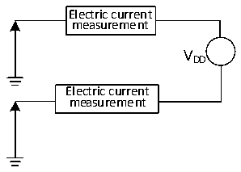

<!-- source-page: 16 -->

[← p.15](0015.md) · [index](../README.md) · [PDF p.16](https://ch32-riscv-ug.github.io/CH32V003/datasheet_zh/CH32V003DS0.PDF#page=16) · [p.17 →](0017.md)

<!-- header: CH32V003数据手册 https://wch.cn -->

### 3.3.3 内置的参考电压

<!-- p16-table-001 (table-3-5@1) -->
<table><caption>表3-5 内置参考电压</caption><tr><th>符号</th><th>参数</th><th>条件</th><th>最小值</th><th>典型值</th><th>最大值</th><th>单位</th></tr><tr><td style="text-align:left">VREFINT</td><td>内置参考电压</td><td style="text-align:left">T = -40℃～85℃ A</td><td>1.17</td><td>1.2</td><td>1.23</td><td>V</td></tr><tr><td style="text-align:left">TS_vrefint</td><td style="text-align:left">当读出内部参考电压时，ADC的采样时间</td><td></td><td>3</td><td></td><td>500</td><td style="text-align:left">1/f ADC</td></tr></table>

### 3.3.4 供电电流特性

电流消耗是多种参数和因素的综合指标，这些参数和因素包括工作电压、环境温度、I/O 引脚的  
负载、产品的软件配置、工作频率、I/O 脚的翻转速率、程序在存储器中的位置以及执行的代码等。  
电流消耗测量方法如下图：  

图3-2 电流消耗测量  
 <!-- rendered from the PDF; verify at https://ch32-riscv-ug.github.io/CH32V003/datasheet_zh/CH32V003DS0.PDF#page=16 -->

🖼 Text parsed from the figure above

Electric current  
measurement  
VDD  
Electric current  
measurement  

微控制器处于下列条件：  
常温VDD= 3.3V或5V情况下，测试时：所有IO端口配置下拉输入；测试HSE时打开HSI，测试  
HSI时HSE关闭，HSE= 24M，HSI= 24M（已校准）；当FHCLK= 48MHz、16MHz时，系统时钟来源CLK*2；  
打开所有外设时仅打开所有外设的时钟。使能或关闭所有外设时钟的功耗。  

<!-- p16-table-002 (table-3-6-1@1) -->
<table><caption>表3-6-1 运行模式下典型的电流消耗，数据处理代码从内部闪存中运行（VDD= 3.3V）</caption><tr><th rowspan="2">符号</th><th rowspan="2">参数</th><th rowspan="2" colspan="2">条件</th><th colspan="2">典型值</th><th rowspan="2">单位</th></tr><tr><td>使能所有外设</td><td>关闭所有外设</td></tr><tr><td rowspan="10" style="text-align:left">I (1) DD</td><td rowspan="10" style="text-align:left">运行模式下的供应电流</td><td rowspan="5">外部时钟</td><td style="text-align:left">F = 48MHz HCLK</td><td>7.4</td><td>5.2</td><td rowspan="10">mA</td></tr><tr><td style="text-align:left">F = 24MHz HCLK</td><td>5.6</td><td>4.5</td></tr><tr><td style="text-align:left">F = 16MHz HCLK</td><td>4.7</td><td>3.9</td></tr><tr><td style="text-align:left">F = 8MHz HCLK</td><td>3.0</td><td>2.6</td></tr><tr><td style="text-align:left">F = 750KHz HCLK</td><td>1.7</td><td>1.7</td></tr><tr><td rowspan="5" style="text-align:left">运行于高速内部RC振荡器（HSI）， 使用 AHB 预分频以减低频率</td><td style="text-align:left">F = 48MHz HCLK</td><td>6.4</td><td>4.0</td></tr><tr><td style="text-align:left">F = 24MHz HCLK</td><td>4.6</td><td>3.5</td></tr><tr><td style="text-align:left">F = 16MHz HCLK</td><td>4.0</td><td>3.3</td></tr><tr><td style="text-align:left">F = 8MHz HCLK</td><td>2.4</td><td>2.0</td></tr><tr><td style="text-align:left">F = 750KHz HCLK</td><td>1.1</td><td>1.1</td></tr></table>

注：1.以上为实测参数。  
2.当VDD&lt; 3V时，电流功耗会增大。  
<!-- image: p16-draw-image-00001 bbox=[500.88, 779.28, 520.32, 789.6] -->
<!-- footer: V1.8 15 -->
