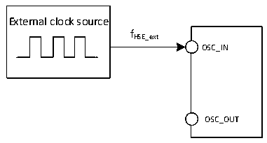

<!-- source-page: 18 -->

[← p.17](0017.md) · [index](../README.md) · [PDF p.18](https://ch32-riscv-ug.github.io/CH32V003/datasheet_zh/CH32V003DS0.PDF#page=18) · [p.19 →](0019.md)

<!-- header: CH32V003数据手册 https://wch.cn -->

<!-- p18-table-001 (table-3-8@1) -->
<table><caption>表3-8待机模式下典型的电流消耗</caption><tr><th>符号</th><th>参数</th><th colspan="2">条件</th><th>典型值</th><th>单位</th></tr><tr><td rowspan="4" style="text-align:left">IDD</td><td rowspan="4">待机模式下的供应电流</td><td rowspan="2">LSI打开</td><td style="text-align:left">V = 3.3VDD</td><td>9.1</td><td rowspan="4">uA</td></tr><tr><td style="text-align:left">V = 5VDD</td><td>9.4</td></tr><tr><td rowspan="2">LSI关闭</td><td style="text-align:left">V = 3.3VDD</td><td>7.6</td></tr><tr><td style="text-align:left">V = 5VDD</td><td>8.0</td></tr></table>

注：1.以上为实测参数。  
2.此测试条件为：在常温VDD= 3.3V或5V情况下，测试初始主频HSI=24M，所有IO端口配置下  
拉输入。  

### 3.3.5 外部时钟源特性

<!-- p18-table-002 (table-3-9@1) -->
<table><caption>表3-9 来自外部高速时钟</caption><tr><th>符号</th><th>参数</th><th>条件</th><th>最小值</th><th>典型值</th><th>最大值</th><th>单位</th></tr><tr><td style="text-align:left">FHSE_ext</td><td>外部时钟频率</td><td></td><td>4</td><td>24</td><td>25</td><td>MHz</td></tr><tr><td style="text-align:left">V (1) HSEH</td><td>OSC_IN输入引脚高电平电压</td><td></td><td style="text-align:left">0.8VDD</td><td></td><td style="text-align:left">VDD</td><td>V</td></tr><tr><td style="text-align:left">V (1) HSEL</td><td>OSC_IN输入引脚低电平电压</td><td></td><td>0</td><td></td><td style="text-align:left">0.2VDD</td><td>V</td></tr><tr><td style="text-align:left">C in(HSE)</td><td>OSC_IN输入电容</td><td></td><td></td><td>5</td><td></td><td>pF</td></tr><tr><td style="text-align:left">DuTy (HSE)</td><td>占空比</td><td></td><td>40</td><td>50</td><td>60</td><td>%</td></tr><tr><td style="text-align:left">IL</td><td>OSC_IN输入漏电流</td><td></td><td></td><td></td><td>±1</td><td>uA</td></tr></table>

注：1.不满足此条件可能会引起电平识别错误。  

图3-3 外部提供高频时钟源电路  
 <!-- rendered from the PDF; verify at https://ch32-riscv-ug.github.io/CH32V003/datasheet_zh/CH32V003DS0.PDF#page=18 -->

🖼 Text parsed from the figure above

External clock source  
fHSE_ext  
OSC_IN  
OSC_OUT  

<!-- p18-table-003 (table-3-10@1) -->
<table><caption>表3-10 使用一个晶体/陶瓷谐振器产生的高速外部时钟</caption><tr><th>符号</th><th>参数</th><th>条件</th><th>最小值</th><th>典型值</th><th>最大值</th><th>单位</th></tr><tr><td style="text-align:left">FOSC_IN</td><td>谐振器频率</td><td></td><td>4</td><td>24</td><td>25</td><td>MHz</td></tr><tr><td style="text-align:left">RF</td><td>反馈电阻（无需外置）</td><td></td><td></td><td>250</td><td></td><td>kΩ</td></tr><tr><td>C</td><td style="text-align:left">建议的负载电容与对应晶体串行阻抗RS</td><td style="text-align:left">R = 60Ω(1) S</td><td></td><td>20</td><td></td><td>pF</td></tr><tr><td style="text-align:left">I2</td><td>HSE驱动电流</td><td style="text-align:left">V = 3.3V，20p负载DD</td><td></td><td>0.32</td><td></td><td>mA</td></tr><tr><td style="text-align:left">g m</td><td>振荡器的跨导</td><td>启动</td><td></td><td>6.8</td><td></td><td>mA/V</td></tr><tr><td style="text-align:left">t SU(HSE)</td><td>启动时间</td><td style="text-align:left">V 稳定，24M晶体DD</td><td></td><td>2</td><td></td><td>ms</td></tr></table>

注：1.25M晶体ESR建议不超过60欧，低于25M可适当放宽。  
电路参考设计及要求：  
晶体的负载电容以晶体厂商建议为准，通常情况CL1=CL2。  
<!-- image: p18-draw-image-00001 bbox=[500.88, 779.28, 520.32, 789.6] -->
<!-- footer: V1.8 17 -->
