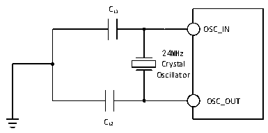

<!-- source-page: 19 -->

[← p.18](0018.md) · [index](../README.md) · [PDF p.19](https://ch32-riscv-ug.github.io/CH32V003/datasheet_zh/CH32V003DS0.PDF#page=19) · [p.20 →](0020.md)

<!-- header: CH32V003数据手册 https://wch.cn -->

图3-4 外接24M晶体典型电路  
 <!-- rendered from the PDF; verify at https://ch32-riscv-ug.github.io/CH32V003/datasheet_zh/CH32V003DS0.PDF#page=19 -->

🖼 Text parsed from the figure above

CL1  
OSC_IN  
24MHz  
Crystal  
Oscillator  
OSC_OUT  
CL2  

### 3.3.6 内部时钟源特性

<!-- p19-table-001 (table-3-11@1) -->
<table><caption>表3-11 内部高速(HSI)RC振荡器特性</caption><tr><th>符号</th><th>参数</th><th>条件</th><th>最小值</th><th>典型值</th><th>最大值</th><th>单位</th></tr><tr><td style="text-align:left">FHSI</td><td>频率(校准后)</td><td></td><td></td><td>24</td><td></td><td>MHz</td></tr><tr><td style="text-align:left">DuCy HSI</td><td>占空比</td><td></td><td>45</td><td>50</td><td>55</td><td>%</td></tr><tr><td rowspan="2" style="text-align:left">ACCHSI</td><td rowspan="2">HSI振荡器的精度（校准后）</td><td>TA = 0℃～70℃</td><td>-1.2</td><td></td><td>1.6</td><td>%</td></tr><tr><td>TA = -40℃～85℃</td><td>-2.2</td><td></td><td>2.2</td><td>%</td></tr><tr><td style="text-align:left">t SU(HSI)</td><td>HSI振荡器启动稳定时间</td><td></td><td></td><td>10</td><td></td><td>us</td></tr><tr><td style="text-align:left">IDD(HSI)</td><td>HSI振荡器功耗</td><td></td><td>120</td><td>180</td><td>270</td><td>uA</td></tr></table>

<!-- p19-table-002 (table-3-12@1) -->
<table><caption>表3-12 内部低速(LSI)RC振荡器特性</caption><tr><th>符号</th><th>参数</th><th>条件</th><th>最小值</th><th>典型值</th><th>最大值</th><th>单位</th></tr><tr><td style="text-align:left">FLSI</td><td>频率</td><td></td><td>100</td><td>128</td><td>150</td><td>KHz</td></tr><tr><td style="text-align:left">DuTy LSI</td><td>占空比</td><td></td><td>45</td><td>50</td><td>55</td><td>%</td></tr><tr><td style="text-align:left">t SU(LSI)</td><td>LSI振荡器启动稳定时间</td><td></td><td></td><td>80</td><td></td><td>us</td></tr><tr><td style="text-align:left">IDD(LSI)</td><td>LSI振荡器功耗</td><td></td><td></td><td>1.5</td><td></td><td>uA</td></tr></table>

### 3.3.7 从低功耗模式唤醒的时间

<!-- p19-table-003 (table-3-13@1) -->
<table><caption>表3-13 低功耗模式唤醒的时间(1)</caption><tr><th>符号</th><th>参数</th><th>条件</th><th>典型值</th><th>单位</th></tr><tr><td style="text-align:left">t wusleep</td><td>从睡眠模式唤醒</td><td>使用HSI RC时钟唤醒</td><td>30</td><td>us</td></tr><tr><td style="text-align:left">t WUSTDBY</td><td>从待机模式唤醒</td><td>LDO稳定时间 + HSI RC时钟唤醒</td><td>200</td><td>us</td></tr></table>

注：以上为实测参数。  

### 3.3.8 存储器特性

<!-- p19-table-004 (table-3-14@1) -->
<table><caption>表3-14 闪存存储器特性</caption><tr><th>符号</th><th>参数</th><th>条件</th><th>最小值</th><th>典型值</th><th>最大值</th><th>单位</th></tr><tr><td style="text-align:left">t ERASE_64</td><td>页（64字节）编程时间</td><td style="text-align:left">T = -20℃～85℃ A</td><td>2.4</td><td></td><td>3.1</td><td>ms</td></tr><tr><td style="text-align:left">t ERASE</td><td>页（64字节）擦除时间</td><td style="text-align:left">T = -20℃～85℃ A</td><td>2.4</td><td></td><td>3.1</td><td>ms</td></tr><tr><td style="text-align:left">t prog</td><td>16位的编程时间</td><td style="text-align:left">T = -20℃～85℃ A</td><td>2.4</td><td></td><td>3.1</td><td>ms</td></tr><tr><td style="text-align:left">t ME</td><td>整片擦除时间</td><td style="text-align:left">T = -20℃～85℃ A</td><td>2.4</td><td></td><td>3.1</td><td>ms</td></tr><tr><td style="text-align:left">V prog</td><td>编程电压</td><td></td><td>2.8</td><td></td><td>5.5</td><td>V</td></tr></table>

<!-- p19-table-005 (table-3-15@1) pages 19-20 -->
<table><caption>表3-15 闪存存储器寿命和数据保存期限</caption><tr><th>符号</th><th>参数</th><th>条件</th><th>最小值</th><th>典型值</th><th>最大值</th><th>单位</th></tr><tr><td style="text-align:left">NEND</td><td>擦写次数</td><td style="text-align:left">T = 25℃ A</td><td>10K</td><td>80K(1)</td><td></td><td>次</td></tr><tr><td style="text-align:left">t RET</td><td>数据保存期限</td><td></td><td>10</td><td></td><td></td><td>年</td></tr></table>

<!-- image: p19-draw-image-00001 bbox=[500.88, 779.28, 520.32, 789.6] -->
<!-- footer: V1.8 18 -->
