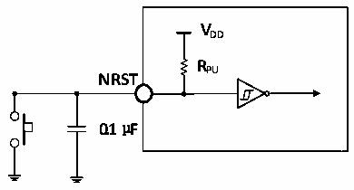

<!-- source-page: 21 -->

[← p.20](0020.md) · [index](../README.md) · [PDF p.21](https://ch32-riscv-ug.github.io/CH32V003/datasheet_zh/CH32V003DS0.PDF#page=21) · [p.22 →](0022.md)

<!-- header: CH32V003数据手册 https://wch.cn -->

> ⬆ **Table continued** — rendered in full at [page 20](0020.md). <!-- p21-table-001 -->

### 3.3.10 NRST引脚特性

<!-- p21-table-002 (table-3-19@1) -->
<table><caption>表3-19 外部复位引脚特性</caption><tr><th>符号</th><th>参数</th><th>条件</th><th>最小值</th><th>典型值</th><th>最大值</th><th>单位</th></tr><tr><td style="text-align:left">VIL(NRST)</td><td>NRST输入低电平电压</td><td></td><td>-0.3</td><td></td><td style="text-align:left">0.28*(V -1.8)+0.6DD</td><td>V</td></tr><tr><td style="text-align:left">VIH(NRST)</td><td>NRST输入高电平电压</td><td></td><td style="text-align:left">0.41*(V -1.8)+1.3DD</td><td></td><td style="text-align:left">V +0.3DD</td><td>V</td></tr><tr><td style="text-align:left">V hys(NRST)</td><td style="text-align:left">NRST施密特触发器电压迟滞</td><td></td><td>150</td><td></td><td></td><td>mV</td></tr><tr><td style="text-align:left">R (1) PU</td><td>弱上拉等效电阻</td><td></td><td>35</td><td>45</td><td>55</td><td>kΩ</td></tr></table>

注：1.上拉电阻是一个真正的电阻串联一个可开关的PMOS实现。这个PMOS/NMOS开关的电阻很小(约  
占10%)。  
电路参考设计及要求：  

图3-5 外部复位引脚典型电路  
 <!-- rendered from the PDF; verify at https://ch32-riscv-ug.github.io/CH32V003/datasheet_zh/CH32V003DS0.PDF#page=21 -->

🖼 Text parsed from the figure above

<strong>VDD</strong>  
<strong>RPU</strong>  
<strong>NRST</strong>  
<strong>0.1μF</strong>  

### 3.3.11 TIM定时器特性

<!-- p21-table-004 (table-3-20@1) -->
<table><caption>表3-20 TIMx特性</caption><tr><th>符号</th><th>参数</th><th>条件</th><th>最小值</th><th>最大值</th><th>单位</th></tr><tr><td rowspan="2" style="text-align:left">t res(TIM)</td><td rowspan="2">定时器基准时钟</td><td></td><td>1</td><td></td><td style="text-align:left">t TIMxCLK</td></tr><tr><td style="text-align:left">f = 48MHz TIMxCLK</td><td>20.8</td><td></td><td>ns</td></tr><tr><td rowspan="2" style="text-align:left">FEXT</td><td rowspan="2">CH1至CH4的定时器外部时钟频率</td><td></td><td>0</td><td style="text-align:left">f /2TIMxCLK</td><td>MHz</td></tr><tr><td style="text-align:left">f = 48MHz TIMxCLK</td><td>0</td><td>24</td><td>MHz</td></tr><tr><td style="text-align:left">R esTIM</td><td>定时器分辨率</td><td></td><td></td><td>16</td><td>位</td></tr><tr><td rowspan="2" style="text-align:left">t COUNTER</td><td rowspan="2" style="text-align:left">当选择了内部时钟时，16 位计数器时钟周期</td><td></td><td>1</td><td>65536</td><td style="text-align:left">t TIMxCLK</td></tr><tr><td style="text-align:left">f = 48MHz TIMxCLK</td><td>0.0208</td><td>1363</td><td>us</td></tr><tr><td rowspan="2" style="text-align:left">t MAX_COUNT</td><td rowspan="2">最大可能的计数</td><td></td><td></td><td>65535</td><td style="text-align:left">t TIMxCLK</td></tr><tr><td style="text-align:left">f = 48MHz TIMxCLK</td><td></td><td>1363</td><td>us</td></tr></table>

<!-- image: p21-draw-image-00001 bbox=[500.88, 779.28, 520.32, 789.6] -->
<!-- footer: V1.8 20 -->
