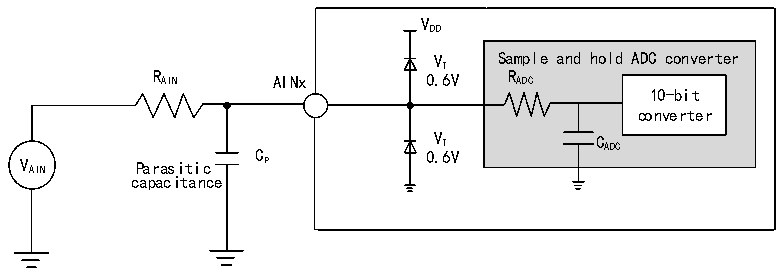

<!-- source-page: 26 -->

[← p.25](0025.md) · [index](../README.md) · [PDF p.26](https://ch32-riscv-ug.github.io/CH32V003/datasheet_zh/CH32V003DS0.PDF#page=26) · [p.27 →](0027.md)

<!-- header: CH32V003数据手册 https://wch.cn -->
公式：最大RAIN  
<em>T</em>  
<em>R &lt; S -R</em>  
<em>AIN f ×C ×ln2N+2 ADC</em>  
<em>ADC ADC</em>  
上述公式用于决定最大的外部阻抗，使得误差可以小于1/4 LSB。其中N=10(表示10位分辨率)。  

<!-- p26-table-001 (table-3-24@1) -->
<table><caption>表3-24 fADC= 12MHz时的最大RAIN</caption><tr><th style="text-align:left">T(周期) S</th><th style="text-align:left">t(us) S</th><th style="text-align:left">最大R (kΩ) AIN</th></tr><tr><td>3.0</td><td>0.25</td><td>8.5</td></tr><tr><td>9.0</td><td>0.75</td><td>28.5</td></tr><tr><td>15.0</td><td>1.25</td><td>48.5</td></tr><tr><td>30.0</td><td>2.50</td><td>98.5</td></tr><tr><td>43.0</td><td>3.58</td><td>142.0</td></tr><tr><td>57.0</td><td>4.75</td><td>/</td></tr><tr><td>73.0</td><td>6.08</td><td>/</td></tr><tr><td>241.0</td><td>20.08</td><td>/</td></tr></table>

<!-- p26-table-002 (table-3-25@1) -->
<table><caption>表3-25 ADC误差（fADC= 12MHz:RAIN&lt; 10kΩ,VDD&gt; 2.9V)（fADC= 24MHz:RAIN&lt; 3kΩ,VDD= 5V）</caption><tr><th>符号</th><th>参数</th><th>条件</th><th>最小值</th><th>典型值</th><th>最大值</th><th>单位</th></tr><tr><td>ET</td><td>数据总偏差</td><td style="text-align:left">f = 12MHz ADC</td><td></td><td>2</td><td>6</td><td rowspan="6">LSB</td></tr><tr><td>ETF24</td><td style="text-align:left">f = 24MHz数据总偏差ADC</td><td style="text-align:left">f = 24MHz ADC</td><td></td><td>3</td><td>8</td></tr><tr><td>EO</td><td>失调误差</td><td style="text-align:left">f = 12MHz ADC</td><td></td><td>1</td><td>5</td></tr><tr><td>EG</td><td>增益误差</td><td style="text-align:left">f = 12MHz ADC</td><td></td><td>1</td><td>2</td></tr><tr><td>ED</td><td>微分非线性误差</td><td style="text-align:left">f = 12MHz ADC</td><td></td><td>0.5</td><td>2</td></tr><tr><td>EL</td><td>积分非线性误差</td><td style="text-align:left">f = 12MHz ADC</td><td></td><td>0.6</td><td>2.5</td></tr></table>

注：来源仿真。  
Cp 表示PCB与焊盘上的寄生电容（大约5pF），可能与焊盘和PCB布局质量有关。较大的Cp 数值将  
降低转换精度，解决办法是降低fADC 值。  

图3-10 ADC典型连接图  
 <!-- rendered from the PDF; verify at https://ch32-riscv-ug.github.io/CH32V003/datasheet_zh/CH32V003DS0.PDF#page=26 -->

🖼 Text parsed from the figure above

VDD  
VT Sample and hold ADC converter  
R AIN AINx 0.6V R ADC  
10-bit  
converter  
V AIN Parasitic C P 0 V . T 6V C ADC  
capacitance  

<!-- image: p26-draw-image-00001 bbox=[500.88, 779.28, 520.32, 789.6] -->
<!-- footer: V1.8 25 -->
