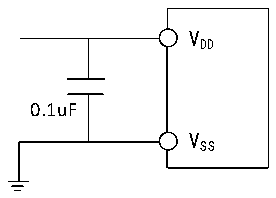

<!-- source-page: 27 -->

[← p.26](0026.md) · [index](../README.md) · [PDF p.27](https://ch32-riscv-ug.github.io/CH32V003/datasheet_zh/CH32V003DS0.PDF#page=27) · [p.28 →](0028.md)

<!-- header: CH32V003数据手册 https://wch.cn -->

图3-11 模拟电源及退耦电路参考  
 <!-- rendered from the PDF; verify at https://ch32-riscv-ug.github.io/CH32V003/datasheet_zh/CH32V003DS0.PDF#page=27 -->

🖼 Text parsed from the figure above

VDD  
0.1uF  
VSS  

### 3.3.15 OPA特性

<!-- p27-table-001 (table-3-26@1) -->
<table><caption>表3-26 OPA特性</caption><tr><th>符号</th><th>参数</th><th>条件</th><th>最小值</th><th>典型值</th><th>最大值</th><th>单位</th></tr><tr><td style="text-align:left">VDD</td><td>供电电压</td><td></td><td>2.8</td><td></td><td>5.5</td><td>V</td></tr><tr><td>CMIR</td><td>共模输入电压</td><td></td><td>0</td><td></td><td style="text-align:left">VDD</td><td>V</td></tr><tr><td style="text-align:left">VIOFFSET</td><td>输入失调电压</td><td></td><td></td><td>±3</td><td>±13</td><td>mV</td></tr><tr><td style="text-align:left">ILOAD</td><td>驱动电流</td><td></td><td></td><td></td><td>1.5</td><td>mA</td></tr><tr><td style="text-align:left">IDDOPAMP</td><td>消耗电流</td><td>无负载，静态模式</td><td></td><td>273</td><td></td><td>uA</td></tr><tr><td style="text-align:left">C (1) MRR</td><td>共模抑制比</td><td>@1KHz</td><td></td><td>81</td><td></td><td>dB</td></tr><tr><td style="text-align:left">P (1) SRR</td><td>电源抑制比</td><td>@1KHz</td><td></td><td>88</td><td></td><td>dB</td></tr><tr><td style="text-align:left">A(1) V</td><td>开环增益</td><td style="text-align:left">C = 50pFLOAD</td><td></td><td>105</td><td></td><td>dB</td></tr><tr><td style="text-align:left">G (1) BW</td><td>单位增益带宽</td><td style="text-align:left">C = 50pFLOAD</td><td></td><td>12</td><td></td><td>MHz</td></tr><tr><td style="text-align:left">P(1) M</td><td>相位裕度</td><td style="text-align:left">C = 50pFLOAD</td><td></td><td>75</td><td></td><td>deg</td></tr><tr><td style="text-align:left">S(1) R</td><td>压摆率</td><td style="text-align:left">C = 50pFLOAD</td><td></td><td>7.7</td><td></td><td>V/us</td></tr><tr><td style="text-align:left">t (1) WAKU P</td><td>关闭到唤醒建立时间，0.1%</td><td style="text-align:left">输入V /2,C =50pF,R =4kΩ DD LOAD LOAD</td><td></td><td>520</td><td></td><td>ns</td></tr><tr><td style="text-align:left">RLOAD</td><td>电阻性负载</td><td></td><td>4</td><td></td><td></td><td>kΩ</td></tr><tr><td style="text-align:left">CLOAD</td><td>电容性负载</td><td></td><td></td><td></td><td>50</td><td>pF</td></tr><tr><td rowspan="2" style="text-align:left">V (2) OHSAT</td><td rowspan="2">高饱和输出电压</td><td style="text-align:left">R = 4kΩ,输入V LOAD DD</td><td style="text-align:left">V -180DD</td><td></td><td></td><td rowspan="2">mV</td></tr><tr><td style="text-align:left">R = 20kΩ,输入V LOAD DD</td><td style="text-align:left">V -36DD</td><td></td><td></td></tr><tr><td rowspan="2" style="text-align:left">V (2) OLSAT</td><td rowspan="2">低饱和输出电压</td><td style="text-align:left">R = 4kΩ,输入0LOAD</td><td></td><td></td><td>5</td><td rowspan="2">mV</td></tr><tr><td style="text-align:left">R = 20kΩ,输入0LOAD</td><td></td><td></td><td>5</td></tr><tr><td rowspan="2">EN(1)</td><td rowspan="2">等效输入电压噪声</td><td style="text-align:left">R = 4kΩ,@1KHz LOAD</td><td></td><td>83</td><td></td><td rowspan="2" style="text-align:left">nv Hz</td></tr><tr><td style="text-align:left">R = 4kΩ,@10KHz LOAD</td><td></td><td>28</td><td></td></tr></table>

注：1.来源设计仿真非实测；  
2.负载电阻会限制饱和输出电压。  
<!-- image: p27-draw-image-00001 bbox=[500.88, 779.28, 520.32, 789.6] -->
<!-- footer: V1.8 26 -->
