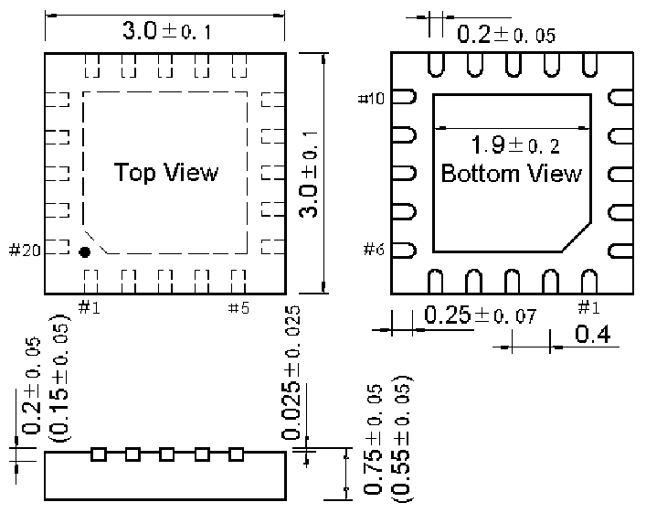

<!-- source-page: 29 -->

[← p.28](0028.md) · [index](../README.md) · [PDF p.29](https://ch32-riscv-ug.github.io/CH32V003/datasheet_zh/CH32V003DS0.PDF#page=29) · [p.30 →](0030.md)

<!-- header: CH32V003数据手册 https://wch.cn -->
说明：尺寸标注的单位是 mm（毫米），引脚中心间距总是标称值，没有误差，除此之外的尺寸误差不  
大于±0.2mm或者±10%两者中的较大值。  

## 4.1 TSSOP20封装

 <!-- p29-draw-image-00002 rendered from the PDF -->

## 4.2 QFN20封装

 <!-- p29-draw-image-00003 rendered from the PDF -->

<!-- image: p29-draw-image-00001 bbox=[500.88, 779.28, 520.32, 789.6] -->
<!-- footer: V1.8 28 -->
