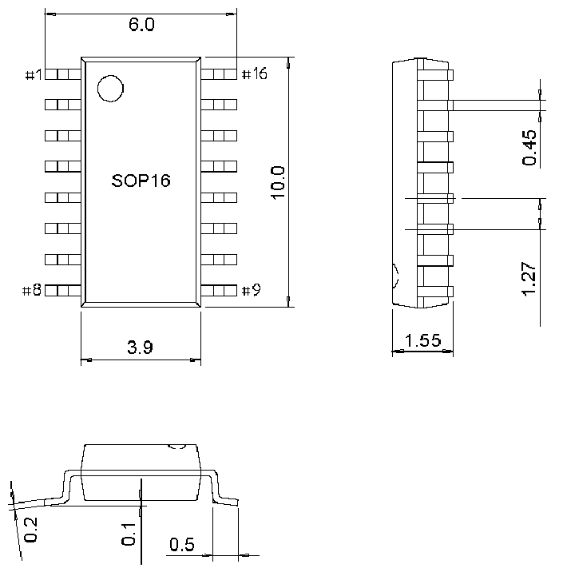
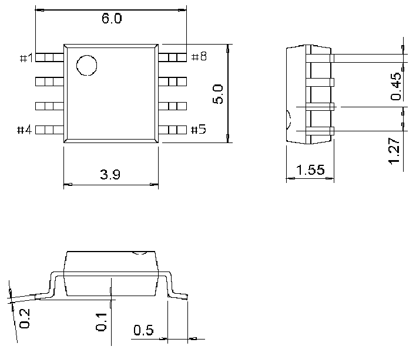

<!-- source-page: 30 -->

[← p.29](0029.md) · [index](../README.md) · [PDF p.30](https://ch32-riscv-ug.github.io/CH32V003/datasheet_zh/CH32V003DS0.PDF#page=30) · [p.31 →](0031.md)

<!-- header: CH32V003数据手册 https://wch.cn -->

## 4.3 SOP16封装

 <!-- p30-draw-image-00002 rendered from the PDF -->

## 4.4 SOP8封装

 <!-- p30-draw-image-00003 rendered from the PDF -->

<!-- image: p30-draw-image-00001 bbox=[500.88, 779.28, 520.32, 789.6] -->
<!-- footer: V1.8 29 -->
